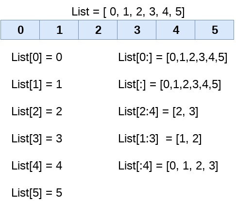
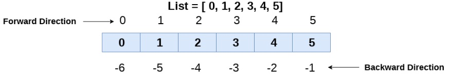
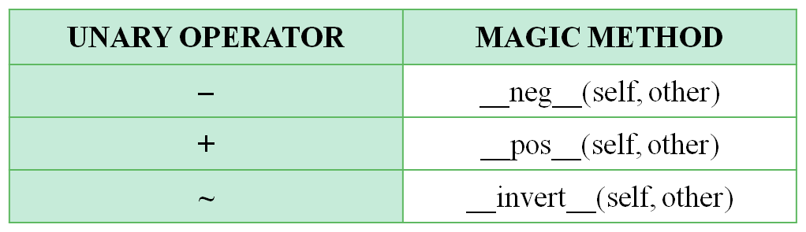
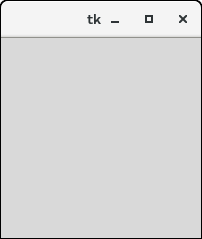
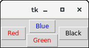
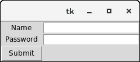
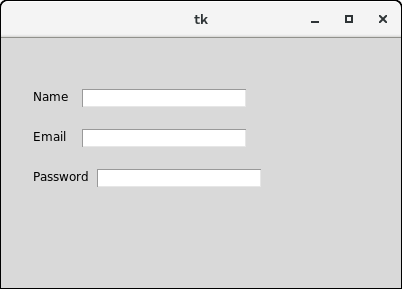
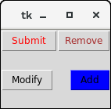
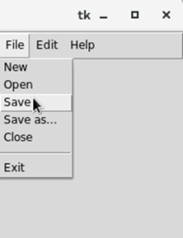

**T.Y.B.B.A.(CA) Semester- V**

**2020-21**

**Lab Book**

**(Python Programming)**

**Roll No: 15**

**Name: Aryaman Satish Kamat**

**Table of contents**

**Exercise 1: Introduction to Basic Python**

**Exercise 2: Working with Strings and List**

**Exercise 3: Working with Tuples, Sets and Dictionaries**

**Exercise 4: Working with Functions, Modules and Packages**

**Exercise 5: Python Classes and Objects**

**Exercise 6: Inheritance**

**Exercise 7: Exception Handling**

**Exercise 8: Python GUI Programming using Tkinter**

**Assignment Completion Sheet**

+------+----------------------------------+----------+-----------------+
| *    | **Assignment**                   | *        | **Teacher**     |
| *Sr. |                                  | *Marks** |                 |
| No** |                                  |          | **Sign**        |
|      |                                  | **(out   |                 |
|      |                                  | of 5)**  |                 |
+======+==================================+==========+=================+
| *    | **Introduction to Basic Python** |          |                 |
| *1** |                                  |          |                 |
+------+----------------------------------+----------+-----------------+
| *    | **Working with Strings and       |          |                 |
| *2** | List**                           |          |                 |
+------+----------------------------------+----------+-----------------+
| *    | **Working with Tuples, Sets and  |          |                 |
| *3** | Dictionaries**                   |          |                 |
+------+----------------------------------+----------+-----------------+
| *    | **Working with Functions,        |          |                 |
| *4** | Modules and Packages**           |          |                 |
+------+----------------------------------+----------+-----------------+
| *    | **Python Classes and Objects**   |          |                 |
| *5** |                                  |          |                 |
+------+----------------------------------+----------+-----------------+
| *    | **Inheritance**                  |          |                 |
| *6** |                                  |          |                 |
+------+----------------------------------+----------+-----------------+
| *    | **Exception Handling**           |          |                 |
| *7** |                                  |          |                 |
+------+----------------------------------+----------+-----------------+
| *    | **Python GUI Programming using   |          |                 |
| *8** | Tkinter**                        |          |                 |
+------+----------------------------------+----------+-----------------+
| **T  |                                  |          |                 |
| otal |                                  |          |                 |
| (out |                                  |          |                 |
| of   |                                  |          |                 |
| 4    |                                  |          |                 |
| 0)** |                                  |          |                 |
+------+----------------------------------+----------+-----------------+
| **T  |                                  |          |                 |
| otal |                                  |          |                 |
| (out |                                  |          |                 |
| of   |                                  |          |                 |
| 1    |                                  |          |                 |
| 0)** |                                  |          |                 |
+------+----------------------------------+----------+-----------------+

**Exercise 1: Introduction to Basic Python**

**Basic Python:**

Python is an interpreted high-level programming language for
general-purpose programming. Python features a dynamic type system and
automatic memory management. It supports multiple programming paradigms,
including object-oriented, imperative, functional and procedural, and
has a large and comprehensive standard library.

# 

# How to Install Python (Environment Set-up):

In order to become Python developer, the first step is to learn how to
install or update Python on a local machine or computer. Now, we will
discuss the installation of Python on windows operating systems.

Visit the
link [*https://www.python.org/downloads/*](https://www.python.org/downloads/) to
download the latest release
of [Python](https://www.javatpoint.com/python-tutorial). In this
process, we will install Python 3.8.6 on our [Windows operating
system](https://www.javatpoint.com/windows). When we click on the above
link, it will bring us the following page.

**Step - 1: Select the Python\'s version to download.**

Click on the download button.

{width="4.2310203412073495in"
height="2.0162642169728784in"}

**Step - 2: Click on the Install Now**

Double-click the executable file, which is downloaded; the following
window will open. Select Customize installation and proceed. Click on
the Add Path check box, it will set the Python path automatically.

{width="4.038767497812773in"
height="1.9777471566054243in"}

We can also click on the customize installation to choose desired
location and features. Other important thing is install launcher for the
all user must be checked.

**Step - 3 Installations in Process**

{width="3.9614359142607176in"
height="1.5887554680664917in"}

**Starting the Interpreter:**

After installation, the python interpreter lives in the installed
directory. By default it is /usr/local/bin/python. X in Linux/Unix and
C:\\PythonXX in Windows, where the \'X\' denotes the version number. To
invoke it from the shell or the command prompt we need to add this
location in the search path. Search path is a list of directories
(locations) where the operating system searches for executables.

For example,

In Windows command prompt, we can type set path=%path%;c:\\python33
(python33 means version 3.3, it might be different in your case) to add
the location to path for that particular session.

**Python Use:**

Python is used by hundreds of thousands of programmers and is used in
many places. Python has many standard library which is made up of many
functions that come with Python when it is installed. On the Internet
there are many other libraries available that make it possible for the
Python language to do more things. These libraries make it a powerful
language; it can do many different things.

Some things that Python is often used for are:

-   Web development

-   Game programming

-   Desktop GUIs

-   Scientific programming

-   Network programming.

**First Python Program:**

This is a small example of a Python program. It shows \"Hello World!\"
on the screen. Type the following code in any text editor or an IDE and
save as helloWorld.py

> print(\"Hello world!\")

Now at the command window, go to the location of this file. You can use
the cd command to change directory. To run the script, type python
helloWorld.py in the command window. We should be able to see the output
as follows:

> Hello world!

**Immediate/Interactive mode:**

Typing python in the command line will invoke the interpreter in
immediate mode. We can directly type in Python expressions and press
enter to get the output.

\>\>\> is the Python prompt. It tells us that the interpreter is ready
for our input. Try typing in 1 + 1 and press enter. We get 2 as the
output. This prompt can be used as a calculator. To exit this mode type
exit() or quit() and press enter.

Type the following text at the Python prompt and press the Enter

\>\>\> print \"Hello World\"

**2. Script Mode Programming**

Invoking the interpreter with a script parameter begins execution of the
script and continues until the script is finished. When the script is
finished, the interpreter is no longer active.

Let us write a simple Python program in a script. Python files have
extension .py. Type the

following source code in a test.py file −

print\"Hello World\"

We assume that you have Python interpreter set in PATH variable. Now,
try to run this program as follows −

\$ python test.py

This produces the following result −

Hello, Python!

**3. Integrated Development Environment (IDE)**

We can use any text editing software to write a Python script file.

We just need to save it with the .py extension. But using an IDE can
make our life a lot easier. IDE is a piece of software that provides
useful features like code hinting, syntax highlighting and checking,
file explorers etc. to the programmer for application development. Using
an IDE can get rid of redundant tasks and significantly decrease the
time required for application development.

IDEL is a graphical user interface (GUI) that can be installed along
with the Python programming language and is available from the official
website. We can also use other commercial or free IDE according to our
preference, the PyScripter IDE can be used for testing. It is free and
open source.

**Python Comments:**

In Python, there are two ways to annotate your code.

Single-line comment -- Comments are created simply by beginning a line
with the hash (#) character, and they are automatically terminated by
the end of line.

For example:

#This would be a comment in Python

**Multi-line comment:**

Multi lined comment can be given inside triple quotes.

'''This is

example of

multiline comments '''

**Indentation:**

Most of the programming languages like C, C++, Java use braces { } to
define a block of code. Python uses indentation. A code block (body of a
function, loop etc.) starts with indentation and ends with the first
unindented line. The amount of indentation is up to you, but it must be
consistent throughout that block. The enforcement of indentation in
Python makes the code look neat and clean. This results into Python
programs that look similar and consistent. In Python, indentation is
used to declare a block. If two statements are at the same indentation
level, then they are the part of the same block.

**Standard Data Types**

Python has five standard data types −

-   Numbers

-   String

-   List

-   Tuple

-   Dictionary

**Python Numbers**: Integers, floating point numbers and complex numbers
falls under Python numbers category. They are defined as int, float and
complex class in Python.

Python supports four different numerical types

-   int (signed integers)

-   long (long integers, they can also be represented in octal and
    hexadecimal)

-   float (floating point real values)

-   complex (complex numbers)

**Python Strings**: Strings in Python are identified as a contiguous set
of characters represented in the quotation marks. Python allows for
either pairs of single or double quotes.

Example: str='Hello all'

**Python Lists :**

Lists are the most versatile of Python\'s compound data types. A list
contains items can be of

different data types separated by commas and enclosed within square
brackets (\[\]).

list_obj=\[\'table\', 59 ,2.69,"chair"\]

**Python Tuples:**

A tuple is another sequence immutable data type that is similar to the
list. A tuple consists of a number of values separated by commas and
enclosed in parentheses ( ( ) ).

Example:

tuple_obj=(786,2.23, "college" )

**Python Dictionary**

Python\'s dictionaries are kind of hash table type. They work like
associative arrays or hashes found in Perl and consist of key-value
pairs.

Dictionaries are enclosed by curly braces ({ })

Example:dict_obj={\'roll_no\': 15,\'name\':'xyz',\'per\': 69.88}

**Python Operators:**

Python language supports the following types of operators.

-   Arithmetic Operators

-   Comparison (Relational) Operators

-   Assignment Operators

-   Logical Operators

-   Bitwise Operators

-   Membership Operators

-   Identity Operators

Arithmetic, logical, Relational operators supported by Python language
are same as other languages like C,C++.

[**i. Arithmetic Operators**:]{.underline}

The new arithmetic operators in python are,

a\) \*\* (Exponent )- Performs exponential (power) calculation on
operators

Example: a\*\*b =10 to the power 20

b\) // (Floor Division) - The division of operands where the result is
the quotient in which

the digits after the decimal point are removed. But if one of the
operands is negative, the

result is floored, i.e., rounded away from zero (towards negative
infinity)

Example: 9//2 = 4 and 9.0//2.0 = 4.0, -11//3 = -4, -11.0//3 = -4.0

**[ii. Logical operators :]{.underline}**

Logical operators are the and, or, not operators.

> a\) and - True if both the operands are true
>
> b\) or - True if either of the operands is true
>
> c\) not - True if operand is false (complements the operand)

**[iii. Relational / Comparison operators]{.underline}** :

== (equal to), != (not equal to ), \< (less than),\<= (Less than or
equal to ), \> (greater than)

and \>= (Greater than or equal to) are same as other language relational
operators.

The new relational operator in python is, \<\>- If values of two
operands are not equal, the condition becomes true.

Example: (a \<\> b) is true. This is similar to != operator.

**[iv. Assignment Operators]{.underline}**: The following are assignment
operators in python which are

> same as in C, C++.
>
> =, +=, - =, \*=, /=, %=, \*\*=, //=

**[v. Bitwise Operators]{.underline}**:The following are bitwise
operators in python which are same as in

> C,C++. &(bitwise AND), \|(bitwise OR) ,\^ (bitwise XOR),\~ (bitwise
> NOT ),\<\<( bitwise left
>
> shift ), \>\>( bitwise right shift )

**[vi. Membership operators :]{.underline}**

> in and not in are the membership operators; used to test whether a
> value or variable is in a
>
> sequence.
>
> in - True if value is found in the sequence
>
> not in - True if value is not found in the sequence

**[vii. Identity operators]{.underline}** :

> is and is not are the identity operators both are used to check if two
> values are located on the
>
> same part of the memory. Two variables that are equal does not imply
> that they are identical.
>
> is - True if the operands are identical
>
> is not - True if the operands are not identical

**Decision making Statement:**

Python programming language provides following types of decision making
statements.

i\. **If statement**: It is similar to that of other languages

Syntax

if expression:

statement(s)

ii**. IF\...ELIF\...ELSE** Statements:

Syntax

if expression:

statement(s)

else:

statement(s)

iii\. **nested IF** statements:

In a nested if construct, you can have an if\...elif\...else construct
inside

another if\...elif\...else construct.

Syntax

> if expression1:
>
> statement(s)
>
> elif expression2:
>
> statement(s)
>
> elif expression3:
>
> statement(s)
>
> else:
>
> statement(s)

**Python Loops:**

i\. **while loop:**

A while loop statement in Python programming language repeatedly
executes a target

statement as long as a given condition is true.

Syntax

> while expression:

statement(s)

Example:

> count=0
>
> while(count \<3):
>
> print(\'The count is:\', count)
>
> count= count +1

ii**. for loop:**

It has the ability to iterate over the items of any sequence, such as a
list or a string.

Syntax

for iterating_var in sequence:

statements(s)

Example:

for x in\'Hi\':

print x

**Command Line Arguments:**

You can get access to the command line parameters using the sys module.
len(sys.argv) contains the number of arguments. To print all of the
arguments simply execute str(sys.argv)

import sys

print(\'Arguments:\', len(sys.argv))

print(\'List:\', str(sys.argv))

**Python Input and Output:**

The functions like input() and print() are widely used for standard
input and output operations respectively.

**Python Output Using print() function:**

We use the print() function to output data to the standard output device
(screen).

For example

\>\>\>print("Python is very easy") Output: Python is very easy

\>\>\> a=5

\>\>\> print("The value of a is ",a) Output: The value of a is 5

In the second print() statement, we can notice that a space was added
between the string and the value of variable a. This is by default. The
actual syntax of the print() function is

print(\*objects, sep=\' \', end=\'\\n\', file=sys.stdout, flush=False)

> Here, objects is the value(s) to be printed.
>
> The sep separator is used between the values. It defaults into a space
> character.
>
> After all values are printed, end is printed. It defaults into a new
> line.
>
> The file is the object where the values are printed and its default
> value is sys.stdout (screen).

\>\>\>print(1,2,3,4) output: 1 2 3 4

\>\>\>print(1,2,3,4,sep=\'\*\') Output:1\*2\*3\*4

\>\>\>print(1,2,3,4,sep=\'#\',end=\'&\') Output: 1#2#3#4&

**Python Input:** The function input() is used to accept the input from
user Syntax of input function is input(string)

Eg. \>\>\>num=input("Enter any number=")

\>\>\> print(num)

Output: Enter any number=10

10

In python each input is accepted in the form of string. To convert it
into number we can use int() or float() function

Eg. \>\>\>num1=int(input("Enter any Number"))

\>\>\>num2=float(input("Enter anyNumber"))

**Assignments:**

**Practice Set:**

1.  A cashier has currency notes of denomination 1, 5 and 10. Write
    python script to accept the amount to be withdrawn from the user and
    print the total number of currency notes of each denomination the
    cashier will have to give.

2.  Write a python script to accepts annual basic salary of an employee
    and calculates and displays the Income tax as per the following
    rules.

Basic: \< 2,50,000 Tax = 0

Basic: 2,50,000 to 5,00,000 Tax = 10%

Basic: \> 5,00,000 Tax = 20

3.  Write python script to accept the x and y coordinate of a point and
    find the quadrant in which the point lies.

4.  Write a python script to accept the cost price and selling price
    from the keyboard. Find out if the seller has made a profit or loss
    and display how much profit or loss has been made.

**Set A:**

1.  Write python script to calculate sum of digits of a given input
    number.

2.  Write python script to check whether a input number is Armstrong
    number or not.

3.  Write python script to check whether a input number is perfect
    number of not.

4.  Write a program to calculate X^Y^

5.  Write a program to check whether a input number is palindrome or
    not.

6.  Write a program to calculate sum of first and last digit of a
    number.

**Set B:**

1.  Write a program to accept a number and count number of even, odd,
    zero digits within that number.

2.  Write a program to accept a binary number and convert it into
    decimal number.

3.  Write a program which accepts an integer value as command line and
    print "Ok" if value is between 1 to 50 (both inclusive) otherwise it
    prints "Out of range"

4.  Write a program which accept an integer value 'n' and display all
    prime numbers till 'n'.

5.  Write python script to accept two numbers as range and display
    multiplication table of all numbers within that range.

**Set C:**

1.  Write a python script to generate the following pattern up to n
    lines

> 1
>
> 1 2 1
>
> 1 2 3 2 1
>
> 1 2 3 4 3 2 1

**Assignment Evaluation**

**0: Not Done \[ \] 1: Incomplete \[ \] 2: Late Complete \[ \]**

**3: Need Improvement \[ \] 4: Complete \[ \] 5: Well Done \[ \]**

**Signature of the Instructor**

**Exercise 2: Working with String and List**

**Python String:**

In python string is sequence of characters enclosed either in single,
double or triple quotes

Ex. str1="Python"; str2='Hi'; str3='''Hi''';

String "Python" will be stored from index 0 as shown in following figure

0 1 2 3 4 5

  -----------------------------------------------------------------------
  ***P***     **y**       **t**       **h**       **o**       **n**
  ----------- ----------- ----------- ----------- ----------- -----------

  -----------------------------------------------------------------------

Following are the methods of accessing string in python

\>\>\>print(str1) #output: Python

\>\>\>print(str1\[0\]) #output: P

\>\>\>for i in str:

print(i,end=" ") #output: P y t h o n

\>\>\>for i in range(len(str1)):

print(str1\[i\],end=" ") #output: P y t h o n

**Types of Strings:**

There are two types of Strings supported in Python:

a)  Single line String- Strings that are terminated within a single line
    are known as Single line Strings.

Eg:\>\>\> text1='hello'

b)  Multi line String: A piece of text that is spread along multiple
    lines is Multiple line String.

There are two ways to create Multiline Strings:

1.  Adding black slash at the end of each line.

Eg: \>\>\> text1=\'hello\\  

user\'  

\>\>\> text1   #output: hellouser  

2.  Using triple quotation marks:

Eg: \>\>\> str2=\'\'\'welcome 

to

SSSIT\'\'\'  

\>\>\> print str2  

\# output: welcome  

to

SSSIT

**String Operators:**

1.  \+ : It is concatenation operator used to connect two strings

> Ex: str1="Hi"; str2="Hello";

print(str1+str2) #output: HiHello

print(str2+str1) #output: HelloHi

2.  \* : It is repetition operator used to connect multiple copies of
    the same string with itself

> Ex: str="Python"

print(str\*3) #output: PythonPythonPython

3.  \[ \] : It is slice operator used to access character of a string
    from specific index

> Ex: print(str\[4\]) #output: o

4.  \[:\] :It is called as rang slice operator used to access substring
    of string from the specific range

> Ex: print(str\[2:4\]) #output: th

5.  **in:** It is membership operator which return True if substring is
    available in specified string, False otherwise

> Ex. str="Python";
>
> print("th" in str) #output: True
>
> print("a" in str) #output: False

6.  **not in:** it is also membership operator which return true if a
    substring does not available in specified string, True otherwise

> Ex. print("Py" not in str) #output: False
>
> print("xyz" not in str) #output: True

7.  **r/R:** It is used to specify raw string. Raw string are string
    which treat backslash(\\) as a string literal.

> Ex. Print("Hi\\nHello") #output: Hi
>
> Hello
>
> print(r"Hi\\nHello") #output: Hi\\nHello

**Escape Characters:**

Following table is a list of escape or non-printable characters that can
be represented with

backslash notation.

An escape character gets interpreted; in a single quoted as well as
double quoted strings.

  -----------------------------------------------------------------------
  Backslash         Notation
  ----------------- -----------------------------------------------------
  \\a               Bell or alert

  \\b               Backspace

  \\cx or \\C-x     Control-x

  \\f               Formfeed

  \\M-\\C-x         Meta-Control-x

  \\n               Newline

  \\r               Carriage return

  \\s               Space

  \\t               tab

  \\nnn             Octal notation, where n is in the range 0.7

  \\v               Vertical tab

  \\x               Character x
  -----------------------------------------------------------------------

**Built in string Methods:**

  -----------------------------------------------------------------------------------------------------------------------------------------------------------
  **Method**                                                                                     **Description**
  ---------------------------------------------------------------------------------------------- ------------------------------------------------------------
  [[capitalize()]{.underline}](https://www.w3schools.com/python/ref_string_capitalize.asp)       Converts the first character to upper case

  [[casefold()]{.underline}](https://www.w3schools.com/python/ref_string_casefold.asp)           Converts string into lower case

  [[center()]{.underline}](https://www.w3schools.com/python/ref_string_center.asp)               Returns a centered string

  [[count()]{.underline}](https://www.w3schools.com/python/ref_string_count.asp)                 Returns the number of times a specified value occurs in a
                                                                                                 string

  [[encode()]{.underline}](https://www.w3schools.com/python/ref_string_encode.asp)               Returns an encoded version of the string

  [[endswith()]{.underline}](https://www.w3schools.com/python/ref_string_endswith.asp)           Returns true if the string ends with the specified value

  [[expandtabs()]{.underline}](https://www.w3schools.com/python/ref_string_expandtabs.asp)       Sets the tab size of the string

  [[find()]{.underline}](https://www.w3schools.com/python/ref_string_find.asp)                   Searches the string for a specified value and returns the
                                                                                                 position of where it was found

  [[format()]{.underline}](https://www.w3schools.com/python/ref_string_format.asp)               Formats specified values in a string

  format_map()                                                                                   Formats specified values in a string

  [[index()]{.underline}](https://www.w3schools.com/python/ref_string_index.asp)                 Searches the string for a specified value and returns the
                                                                                                 position of where it was found

  [[isalnum()]{.underline}](https://www.w3schools.com/python/ref_string_isalnum.asp)             Returns True if all characters in the string are
                                                                                                 alphanumeric

  [[isalpha()]{.underline}](https://www.w3schools.com/python/ref_string_isalpha.asp)             Returns True if all characters in the string are in the
                                                                                                 alphabet

  [[isascii()]{.underline}](https://www.w3schools.com/python/ref_string_isascii.asp)             Returns True if all characters in the string are ascii
                                                                                                 characters

  [[isdecimal()]{.underline}](https://www.w3schools.com/python/ref_string_isdecimal.asp)         Returns True if all characters in the string are decimals

  [[isdigit()]{.underline}](https://www.w3schools.com/python/ref_string_isdigit.asp)             Returns True if all characters in the string are digits

  [[isidentifier()]{.underline}](https://www.w3schools.com/python/ref_string_isidentifier.asp)   Returns True if the string is an identifier

  [[islower()]{.underline}](https://www.w3schools.com/python/ref_string_islower.asp)             Returns True if all characters in the string are lower case

  [[isnumeric()]{.underline}](https://www.w3schools.com/python/ref_string_isnumeric.asp)         Returns True if all characters in the string are numeric

  [[isprintable()]{.underline}](https://www.w3schools.com/python/ref_string_isprintable.asp)     Returns True if all characters in the string are printable

  [[isspace()]{.underline}](https://www.w3schools.com/python/ref_string_isspace.asp)             Returns True if all characters in the string are whitespaces

  [[istitle()]{.underline}](https://www.w3schools.com/python/ref_string_istitle.asp)             Returns True if the string follows the rules of a title

  [[isupper()]{.underline}](https://www.w3schools.com/python/ref_string_isupper.asp)             Returns True if all characters in the string are upper case

  [[join()]{.underline}](https://www.w3schools.com/python/ref_string_join.asp)                   Converts the elements of an iterable into a string

  [[ljust()]{.underline}](https://www.w3schools.com/python/ref_string_ljust.asp)                 Returns a left justified version of the string

  [[lower()]{.underline}](https://www.w3schools.com/python/ref_string_lower.asp)                 Converts a string into lower case

  [[lstrip()]{.underline}](https://www.w3schools.com/python/ref_string_lstrip.asp)               Returns a left trim version of the string

  [[maketrans()]{.underline}](https://www.w3schools.com/python/ref_string_maketrans.asp)         Returns a translation table to be used in translations

  [[partition()]{.underline}](https://www.w3schools.com/python/ref_string_partition.asp)         Returns a tuple where the string is parted into three parts

  [[replace()]{.underline}](https://www.w3schools.com/python/ref_string_replace.asp)             Returns a string where a specified value is replaced with a
                                                                                                 specified value

  [[rfind()]{.underline}](https://www.w3schools.com/python/ref_string_rfind.asp)                 Searches the string for a specified value and returns the
                                                                                                 last position of where it was found

  [[rindex()]{.underline}](https://www.w3schools.com/python/ref_string_rindex.asp)               Searches the string for a specified value and returns the
                                                                                                 last position of where it was found

  [[rjust()]{.underline}](https://www.w3schools.com/python/ref_string_rjust.asp)                 Returns a right justified version of the string

  [[rpartition()]{.underline}](https://www.w3schools.com/python/ref_string_rpartition.asp)       Returns a tuple where the string is parted into three parts

  [[rsplit()]{.underline}](https://www.w3schools.com/python/ref_string_rsplit.asp)               Splits the string at the specified separator, and returns a
                                                                                                 list

  [[rstrip()]{.underline}](https://www.w3schools.com/python/ref_string_rstrip.asp)               Returns a right trim version of the string

  [[split()]{.underline}](https://www.w3schools.com/python/ref_string_split.asp)                 Splits the string at the specified separator, and returns a
                                                                                                 list

  [[splitlines()]{.underline}](https://www.w3schools.com/python/ref_string_splitlines.asp)       Splits the string at line breaks and returns a list

  [[startswith()]{.underline}](https://www.w3schools.com/python/ref_string_startswith.asp)       Returns true if the string starts with the specified value

  [[strip()]{.underline}](https://www.w3schools.com/python/ref_string_strip.asp)                 Returns a trimmed version of the string

  [[swapcase()]{.underline}](https://www.w3schools.com/python/ref_string_swapcase.asp)           Swaps cases, lower case becomes upper case and vice versa

  [[title()]{.underline}](https://www.w3schools.com/python/ref_string_title.asp)                 Converts the first character of each word to upper case

  [[translate()]{.underline}](https://www.w3schools.com/python/ref_string_translate.asp)         Returns a translated string

  [[upper()]{.underline}](https://www.w3schools.com/python/ref_string_upper.asp)                 Converts a string into upper case

  [[zfill()]{.underline}](https://www.w3schools.com/python/ref_string_zfill.asp)                 Fills the string with a specified number of 0 values at the
                                                                                                 beginning
  -----------------------------------------------------------------------------------------------------------------------------------------------------------

**Python List:**

A list can be defined as a collection of values or items of different
types.

The items in the list are separated with the comma (,) and enclosed with
the square brackets \[\].

Ex. \>\>\> List=\[10,20,\"Hi\",\"Hello\",4.5\]

\>\>\> print(List) #output: \[10, 20, \'Hi\', \'Hello\', 4.5\]

\>\>\> for i in List:

print(i,end=\" ") #output: 10 20 Hi Hello 4.5

\>\>\> for i in range(len(List)):

print(List\[i\],end=\" ") #output: 10 20 Hi Hello 4.5

\>\>\>print(\"%d,%d,%s,%s,%f\"%(List\[0\], List\[1\], List\[2\],
List\[3\], List\[4\]))

#output: 10,20,Hi,Hello,4.500000

**List indexing and splitting:**

The elements of the list can be accessed using the slice operator \[\].

The index starts from 0 and goes to length - 1. The first element of the
list is stored at the 0th index, the second element of the list is
stored at the 1st index, and so on.

Consider the following example.

{width="2.916404199475066in"
height="2.041482939632546in"}

The negative indices are counted from the right.

The last element (right most) of the list has the index -1, its adjacent
left element is present at the index -2 and so on until the left most
element is encountered.

{width="5.015625546806649in"
height="0.6145833333333334in"}

Ex. \>\>\> print(List\[-1\]) #output: 5

**Updating List Values:** List values can be updated by using the slice
and assignment operator.

Ex. \>\>\>list=\[1,2,3,4\]

\>\>\>print(list) #: \[1,2,3,4\]

\>\>\>list\[2\]=45

\>\>\>print(list) #:\[1,2,45,4\]

\>\>\>list\[1:3\]=\[55,56\]

\>\>\>print(list) #:\[1,55,56,4\]

**Deleting List Element:**

The list elements can be deleted by using the del keyword.

\>\>\> list=\[10,20,30,40\]

\>\>\> print(list) #\[10, 20, 30, 40\]

\>\>\> del list\[0\]

\>\>\> print(list) \# \[20, 30, 40\]

\>\>\> del list\[2\]

\>\>\> print(list) \# \[20, 30\]

**Python List Operator:**

The concatenation (+) and repetition (\*) operator work in the same way
as they were working with the strings.

Ex. \>\>\>L1=\[10,20,30\];

\>\>\>L2=\[40,50\]

\>\>\>print(L1\*2) #\[10,20,30,10,20,30\]

\>\>\>print(L1+L2) #\[10,20,30,40,50\]

Membership operator in and not in can also be used to perform operation
on list

Ex. \>\>\>L1=\[10,20,30\]

\>\>\> print (20 in L1) #True

\>\>\>print (40 in L1) #False

\>\>\>print(50 not in L1) #True

\>\>\>print(30 not in L1) #False

**Adding elements to the list:**

-   Python provides append() function by using which we can add an
    element to the list. However, the append() method can only add the
    value to the end of the list.

-   Ex.\>\>\>L1.append(40)

\>\>\>print(L1) #\[10,20,30,40\]

**Removing specific elements from the list:**

-   remove() method is used to delete specific element for list

Ex. \>\>\>L1=\[10,20,30\]

\>\>\>print(L1) \# \[10,20,30\]

\>\>\> L1.remove(20)

\>\>\>print(L1) #\[10,30\]

**Python List Built-in functions:**

1.  cmp(list1, list2): used to compare two list. The function return 0
    if both the list are same,-1 otherwise

Ex. \>\>\>L1=\[10,20\]; L2=\[20,30\]; L3=\[10,20\]

\>\>\>cmp(L1,L2) \# -1

\>\>\>cmp(L1,L3) \# 0

2.  len(list): It is used to calculate the length of the list.

\>\>\>print(len(L1)) \# 2

3.  max(list): It returns the maximum element of the list.

```{=html}
<!-- -->
```
4.  min(list): It returns the minimum element of the list.

Ex. \>\>\>L1=\[16,3,24,12\]

\>\>\>print(max(L1)) #24

\>\>\>print(min(L1)) \# 3

5.  list(seq): It converts any sequence to the list.

Ex. \>\>\>str="Python"

\>\>\>L1=list(str)

\>\>\>print(L1) #\['P','y','t','h','o','n'\]

6.  list.count(obj.): It returns the number of occurrences of the
    specified object in the list.

Ex. \>\>\>L1=\[10,20,40,10,20\]

\>\>\>print(L1.count(20)) #2

7.  list.extend(seq): The sequence represented by the object seq is
    extended to the list.

Ex. \>\>\> L1=\[10,20\]; str="abc"

\>\>\>print(L1) #\[10,20\]

\>\>\>print(L1.extend(str)) #\[10,20,'a','b','c'\]

8.  list.index(obj): It returns the lowest index in the list that object
    appears.

Ex. \>\>\>L1=\[10,20,30,20\]

\>\>\> print(L1.index(20)) \# 1

9.  list.insert(index, obj): The object is inserted into the list at the
    specified index.

Ex \>\>\>L1=\[10,20,30\]

\>\>\>L1.insert(2,40)

\>\>\>print(L1) #\[10,20,40,30\]

10. list.pop(): It removes and returns the last object of the list.

Ex \>\>\>L1=\[10,20,30\]

\>\>print(L1.pop()) #30

11. list.reverse(): It reverses the list.

Ex. \>\>\>print(L1.reverse()) \# \[30 20 10\]

12. list.sort(): It sorts the list

**Indexing, Slicing:**

we will focus on indexing and slicing operations over Python's lists.

**Indexing:**

In Python, list is just like arrays in other scripting languages. It
allows you to store set of items in one place and access an item by its
index. In python list, index starts form 0

Ex. City=\['Pune', 'Mumbai', 'Nasik', 'Nagpur'\]

Each item in the list have value and index. First value of the list city
is 'Pune' having index 0, second item in the list is 'Mumbai' having
index 1 and so on

To accsess the element by index we use square brackets

\>\>\> print(city\[0\], city\[2\]) #'Pune' 'Nasik'

**Negative indexing:**

Python list also support negative indexing system.

In negative indexing system last element of the list corresponds to
index -1, second last element correspond to -2 and so on

\>\>\> print(city\[-1\],city\[-2\]) \# 'Nagpur' 'Nasik'

Indexing not only used for accessing the content of a list but also it
is possible to change list content using an assignment operation

Ex. \>\>\> print(city) #\['Pune', 'Mumbai', 'Nasik', 'Nagpur'\]

\>\>\> city\[0\]="Pimpri'

\>\>\>print(city) #\['Pimpri', 'Mumbai', 'Nasik', 'Nagpur'\]

\>\>\> city\[-1\]='Jalgaon'

\>\>\> print(city) #\['Pimpri', 'Mumbai', 'Nasik', 'Jalgaon'\]

**Deletion:**

We can also easily delete any element from the list by using indexing
and del statement

Ex. \>\>\>print(city) #\['Pune', 'Mumbai', 'Nasik', 'Nagpur'\]

\>\>\> del city\[0\]

\>\>\> print(city) #\['Mumbai', 'Nasik', 'Nagpur'\]

\>\>\> del city(-2)

\>\>\> print(city) #\['Mumbai','Nagpur'\]

**Slice Notation:**

As it was shown, indexing allows you to access/change/delete only a
single cell of a list.

Using slice notation we can access/change/delete sublist of the list.

The full slice syntax is \[start: stop: step\]

Start refers to the index of the element which is used as a start of our
slice. 

Stop refers to the index of the element we should stop just before to
finish our slice. 

Step allows you to take each nth-element within a start: stop range.

Ex. \>\>\>L=\[10,20,30,40,50,60,70,80\]

> \>\>\>print(L\[2:6\]) \# \[30,40,50,60\]
>
> \>\>\>print(L\[:4\]) #\[10,20,30,40\]
>
> \>\>\>print(L\[0:\]) #\[10,20,30,40,50,60,70,80\]
>
> \>\>\>print(L\[:\]) #\[10,20,30,40,50,60,70,80\]
>
> \>\>\>print(L\[-6:4\]) #\[30,40\]
>
> \>\>\>print(L\[-3:\]) #\[60,70,80\]
>
> \>\>\>print(L\[1:-1\]) #\[20,30,40,50,60,70\]
>
> \>\>\>print(L\[-5:-2\]) #\[40,50,60\]
>
> \>\>\>print(L\[1:8:2\]) #\[20,40,60\]
>
> \>\>\>print(L\[: :3\]) #\[10,30,60\]
>
> \>\>\>print(L\[-2:1:-3\]) #\[70,40\]

**Slicing and Coping List:**

> \>\>\>L1=\[10,20,30,40,50,60\]
>
> \>\>\>L2=L1\[1:4\]
>
> \>\>\>print(L2) #\[20,,30,40\]

**Slice Assignment:**

> \>\>\>L1\[:3\]=\[7,8,9\]
>
> \>\>\>print(L1) #\[7,8,9,40,50,60\]

**Replace and Resize part of the list:**

It's also possible to replace a bigger chunk with a smaller number of
items:

> \>\>\>L1=\[10,20,30,40,50,60\]
>
> \>\>\>L1\[:3\]=\[1\]
>
> \>\>\>print(L1) #\[1,40,50,60\]

We can also replace part of list with bigger chunk

> \>\>\>L1=\[10,20,30,40,50,60\]
>
> \>\>\>L1\[:3\]=\[6,7,8,9,25\]
>
> \>\>\>print(L1) #\[6,7,8,9,25,40,50,60\]

**Slice Deletion:**

We can use del statement to remove a slice out of a list:

> \>\>\>L1=\[10,20,30,40,50,60\]
>
> \>\>\>del L1\[2:5\]
>
> \>\>\>print (L1) #\[10,20,60\]

-   We can also provide step parameter to slice and remove each n-th
    element:

> \>\>\>L1=\[10,20,30,40,50,60,70,80\]
>
> \>\>\>del L1\[ : : 2\]
>
> \>\>\>print(L1) #\[20,40,60,80\]

**Assignments:**

**Practice Set**

1.  Write a python script to create a list and display the list element
    in reverse order

2.  Write a python script to display alternate characters of string from
    both the direction.

3.  Write a python program to count vowels and consonants in a string.

**Set A**

1.  Write a python script which accepts 5 integer values and prints
    "DUPLICATES" if any of the values entered are duplicates otherwise
    it prints "ALL UNIQUE". Example: Let 5 integers are (32, 45, 90,
    45, 6) then output "DUPLICATES" to be printed.

2.  Write a python script to count the number of characters (character
    frequency) in a string. Sample String : google.com\'. Expected
    Result : {\'o\': 3, \'g\': 2, \'.\': 1, \'e\': 1, \'l\': 1, \'m\':
    1, \'c\': 1}

3.  Write a Python program to remove the characters which have odd index
    values of a given string.

4.  Write a program to implement the concept of stack using list

5.  Write a Python program to get a string from a given string where all
    occurrences of its first char have been changed to \'\$\', except
    the first char itself. Sample String: \'restart\' Expected Result :
    \'resta\$t\'

**Set B**

1.  Write a Python program to get a string made of the first 2 and the
    last 2 chars from a given a string. If the string length is less
    than 2, return instead of the empty string.

> Sample String : \'General12\'
>
> Expected Result : \'Ge12\'
>
> Sample String : \'Ka\'
>
> Expected Result : \'KaKa\'
>
> Sample String : \' K\'
>
> Expected Result : Empty String

2.  Write a Python program to get a single string from two given
    strings, separated by a space and swap the first two characters of
    each string.

> Sample String : \'abc\', \'xyz\'
>
> Expected Result : \'xycabz\'

3.  Write a Python program to count the occurrences of each word in a
    given sentence.

4.  Write a program to implement the concept of queue using list

5.  Write a python program to count repeated characters in a string.

> Sample string: \'thequickbrownfoxjumpsoverthelazydog\'
>
> Expected output:
>
> o 4
>
> e 3
>
> u 2
>
> h 2
>
> r 2
>
> t 2

**Set C:**

1.  Write a binary search function which searches an item in a sorted
    list. The function should return the index of element to be searched
    in the list.

**Assignment Evaluation**

**0: Not Done \[ \] 1: Incomplete \[ \] 2: Late Complete \[ \]**

**3: Need Improvement \[ \] 4: Complete \[ \] 5: Well Done \[ \]**

**Signature of the Instructor**

**Assignment No. 3: Working With Tuples, Sets and Dictionaries**

**Python Tuple:**

A Tuple is a collection of Python objects separated by commas or written
in round brackets.

Ex \>\>\>T1="Hi", "Hello"

\>\>\>print(T1) #output: ( 'Hi', 'Hello')

\>\>\>T2=(10,20,4.5,"Monday")

\>\>\>print(T2) #output: (10,20,4.5,'Mondy')

Tuples are sequences, just like lists. The differences between tuples
and lists are, the tuples cannot be changed unlike lists and tuples use
parentheses, whereas lists use square brackets.

\>\>\>print(T1\[0\]) #'Hi'

\>\>\>print(T1\[-1\]) #'Hello'

\>\>\>T1\[0\]="Bye" #Error

**Change Tuple Values:**

Once a tuple is created, you cannot change its values. Tuples
are unchangeable, or immutable 

For changing tuple values you can convert the tuple into a list, change
the list, and convert the list back into a tuple.

Ex

\>\>\>T1=("Hi", "Hello") #Tuple T1

\>\>\> T1\[0\]="Bye" #Error

\>\>\>T2=list(T1) #Converting Tuple T1 to list T2

\>\>\>T2\[0\]="Bye" #Updating List T2

\>\>\>T1=tuple(T2) #Converting List T2 to tuple T1

\>\>\>print(T1) #('Bye', 'Hello')

The empty tuple is written as two parentheses containing nothing −
\>\>\> tup1 = ();

To write a tuple containing a single value you have to include a comma,
even though there is only one value - \>\>\>tup1 = (50,);

Like string indices, tuple indices start at 0, and they can be sliced,
concatenated, and so on.

Different ways of accessing Tuple

\>\>\>T1=(10,20,30,40)

\>\>\>print(T1) #(10,20,30,40)

\>\>\>print(T1\[0\]) #10

\>\>\>for i in T1:

print(i,end= " ") #10 20 30 40

\>\>\>for i in range(len(T1)):

print(T1\[i\],end= " ") #10 20 30 40

\>\>\>print("%f"%T1\[0\]) #10.000

**Python Tuple Operator:**

The concatenation (+) and repetition (\*) operator work in the same way
as they were working with the strings.

Ex. \>\>\>T1=(10,20,30);

\>\>\>L2=(40,50)

\>\>\>print(L1\*2) #(10,20,30,10,20,30)

\>\>\>print(L1+L2) #(10,20,30,40,50)

Membership operator in and not in can also be used to perform operation
on list

> Ex. \>\>\>T1=\[10,20,30\]

\>\>\> print (20 in T1) #True

\>\>\>print (40 in T1) #False

\>\>\>print(50 not in T1) #True

\>\>\>print(30 not in T1) #False

**Add Items:**

Once a tuple is created, you cannot add items to it. Tuples
are unchangeable.

**Remove Items:**

Note: You cannot remove items in a tuple.

Tuples are unchangeable, so you cannot remove items from it, but you can
delete the tuple completely: The del keyword can delete the tuple
completely

> Ex. \>\>\>T1=(10,20)

\>\>\>del T1

**In-Built Tuple Functions:**

1.  cmp(): Python tuple method cmp() compares elements of two tuples.

syntax: cmp(tuple1, tuple2)

> cmp function return 0 if two tuples are same, 1 if elements of first
> tuple is greater than elements of second tuple, otherwise -1

2.  len(tuple): It is used to calculate the length of the tuple

\>\>\>T1=(10,20,30)

\>\>\>print(len(T1)) \# 3

3.  max(Tuple): It returns the maximum element of the tuple.

```{=html}
<!-- -->
```
4.  min(Tuple): It returns the minimum element of the tuple.

\>\>\>print(max(T1) #30

\>\>\>print(min(T1)) #10

5.  sum(tuple): Return sum of all elements within tuple

\>\>\> print(sum(T1)) #60

6.  all(tuple): it returns True if all the items in the tuple are true,
    otherwise it returns false. If the tuple is empty, the function also
    returns true.

\>\>\>T1=(10,20,30) T2=(10,0,20)

\>\>\>print(all(T1)) #True

\>\>\>print(all(T2)) #False

7.  any(): Python any() function accepts iterable (list, tuple,
    dictionary etc.) as an argument and return true if any of the
    element in iterable is true, else it returns false. If iterable is
    empty then any() method returns false.

\>\>\>print(any(T1)) #True

8.  tuple(seq): It converts any sequence to the tuple.

\>\>\>str="Python"

\>\>\>T1=tuple(str)

\>\>\>print(T1) #('P','y','t','h','o','n')

9.  tuple.count(obj.): It returns the number of occurrences of the
    specified object in the tuple.

\>\>\>L1=(10,20,40,10,20)

\>\>\>print(L1.count(20)) #2

10. tuple.index(obj): It retuurns the lowest index in the tuple that
    object appears.

\>\>\>T1=(10,20,30,20)

\>\>\> print(T1.index(20)) \# 1

**Packing and Unpacking:**

In tuple packing, we place value into a new tuple while in tuple
unpacking we extract those values back into variables.

> Ex \>\>\> t=(101,"Nilesh",80.78) #tuple packing

\>\>\> (rollno, name, marks)=t #tuple unpacking

\>\>\> print(rollno) \# 101

\>\>\>print(name, marks) #Nilesh 80.78

**Python Set:**

The set in python can be defined as the unordered collection of various
items enclosed within the curly braces. The elements of the set can not
be duplicate. The elements of the python set can not be changed.There is
no index attached to the elements of the set, i.e., we cannot directly
access any element of the set by the index. However, we can print them
all together or we can get the list of elements by looping through the
set.

**Creating a set:**

The set can be created by enclosing the comma separated items with the
curly braces.

Python also provides the set method which can be used to create the set
by the passed sequence.

**Creating set using curly brackets:**

\>\>\> city={\"Pune\", \"Mumbai\", \"Nashik\"}

\>\>\> print(city) \# {\'Pune\', \'Nashik\', \'Mumbai\'}

\>\>\> for i in city:

print(i, end=" ") \# Pune Nashik Mumbai

**Creating set using set() method:**

\>\>\> names=set(\["Shubham", "Nilesh", "Pranav"\])

\>\>\>print(names) #{\'Pranav\', \'Shubham\', \'Nilesh\'}

**Adding items to the set:**

Python provides the add() method which can be used to add some
particular item to the set. 

\>\>\> names.add(\"Rajesh\")

\>\>\> print(names) #{\'Pranav\', \'Shubham\', \'Rajesh\', \'Nilesh\'}

To add more than one item in the set, Python provides
the update() method.

\>\>\> print(city) #{\'Pune\', \'Nashik\', \'Mumbai\'}

\>\>\> city.update(\[\"Jalgaon\",\"Nagpur\",\"Satara\"\])

\>\>\> print(city)

\# {\'Satara\', \'Jalgaon\', \'Pune\', \'Mumbai\', \'Nagpur\',
\'Nashik\'}

**Removing items from the set:**

Python provides discard() method which can be used to remove the items
from the set.

\>\>\> city.discard(\"Mumbai\")

\>\>\> print(city) \# {\'Satara\', \'Jalgaon\', \'Pune\', \'Nagpur\',
\'Nashik\'}

Python also provide the remove() method to remove the items from the
set.

\>\>\> print(city) #{\'Satara\', \'Jalgaon\', \'Pune\', \'Nagpur\',
\'Nashik\'}

\>\>\> city.remove(\"Satara\")

\>\>\> print(city) #{\'Jalgaon\', \'Pune\', \'Nagpur\', \'Nashik\'}

We can also use the pop() method to remove the item. However, this
method will always remove the first item.

\>\>\> print(city) #{\'Jalgaon\', \'Pune\', \'Nagpur\', \'Nashik\'}

\>\>\> city.pop() #\'Jalgaon'

Python provides the clear() method to remove all the items from the set.

\>\>\> print(city) #{\'Nashik\', \'Dhule\'}

\>\>\> city.clear()

\>\>\> print(city) #set()

**Difference between discard() and remove():**

If the item to be deleted from the set using discard() doesn\'t exist in
the set, the python will not give the error.

On the other hand, if the item to be deleted from the set using remove()
doesn\'t exist in the set, the python will give the error.

**Union of two Sets**:

The union of two sets are calculated by using the or (\|) operator. The
union of the two sets contains the all the items that are present in
both the sets.

Ex. \>\>\>s1={1,2,3}; s2={3,4,5}

\>\>\>s3=s1\|s3

\>\>\>print(s3) #{1,2,3,4,5}

Python also provides the union() method which can also be used to
calculate the union of two sets.

\>\>\> print(s1.union(s2)) #{1,2,3,4,5}

**Intersection of two sets:**

The & (intersection) operator is used to calculate the intersection of
the two sets in python.

The intersection of the two sets are given as the set of the elements
that common in both sets.

Ex \>\>\> s1={\"Pune\",\"Mumbai\",\"Jalgaon\"}

\>\>\> s2={\"Nahik\",\"Pune\",\"Nagpur\",\"Jalgaon\"}

\>\>\> s3=s1&s2

\>\>\> print(s3) #{\'Jalgaon\', \'Pune\'}

-   using intersection() method

\>\>\>s3=s1.intersection(s2)

\>\>\>print(s3) #{\'Jalgaon\', \'Pune'}

**The intersection_update() method:**

The intersection_update() method removes the items from the original set
that are not present in both the sets (all the sets if more than one are
specified).

The Intersection_update() method is different from intersection() method
since it modifies the original set by removing the unwanted items, on
the other hand, intersection() method returns a new set.

Ex \>\>\> a={1,2,3,4,5}

\>\>\> b={3,5,7,8,9}

\>\>\> a.intersection_update(b)

\>\>\> print(a) #{3, 5}

**Difference of two sets:**

The difference of two sets can be calculated by using the subtraction
(-) operator.

The resulting set consists of all the elements form set 1 which are not
available in set2

Ex \>\>\> a={1,2,3,4}

\>\>\> b={3,5,4,8}

\>\>\> c=a-b

\>\>\> print(c) #{1, 2}

\>\>\>print(b-a) #{5,8}

using difference() method

\>\>\>print(a.difference(b)) #{1,2}

**The difference_update():**

The set difference_update() method modifies the existing set.

If (A -- B) is performed, then A gets modified into (A -- B), and if (B
-- A) is performed, then B gets modified into ( B -- A).

Ex. \>\>\>a={1,2,3,4,5}; b={3,4,5,6}

\>\>\>a.difference_update(b)

\>\>\>print(a) #{1,2}

**The symmetric_difference():**

This in-built function of Python Set helps us to get the symmetric
difference between two sets, which is equal to the elements present in
either of the two sets, but not common to both the sets.

\>\>\>print(a.symmetirc_difference(b)) #{1,2,6}

**The symmetric_difference_update method:**

symmetric_difference() method returns a new set which contains symmetric
difference of two sets.

The symmetric_difference_update() method updates the set calling
symmetric_difference_update() with the symmetric difference of sets.

\>\>\>a={1,2,3,4}; b={2,3,6,7}

\>\>\>a.symmetric_difference_update(b)

\>\>\>print(a) #{1,4,6,7}

**issuperset() in Python:**

The issuperset() method returns True if all elements of a set A occupies
set B which is passed as an argument and returns false if all elements
of B not present in A.\
This means if A is a superset of B then it returns true; else False

**Syntax:** A.issuperset(B) checks whether A is a superset of B or not.
True if A is a superset of B; otherwise false.

Ex \>\>\>A={1,2,3,4,5}; B={2,3,4}

\>\>\>A.issuperset(B) #True

\>\>\>B.issuperset(A) #False

**issubset() in python:**

returns true if first set is a subset of seconds set otherwise false

\>\>\> A.issubset(B) #False

\>\>\>B.issubset(A) #True

**isdisjoint() function in Python:**

Two sets are said to be disjoint when their intersection is null.

In simple words they do not have any common element in between them.

Syntax: seta.isdisjoint(setb)

\>\>\>a={1,2,3}; b={3,4,5}; c={7,8,9}

\>\>\>a.isdisjoint(b) #False

\>\>\>a.isdisjoint(c) #True

**Set comparisons:**

Python allows us to use the comparison operators i.e., \<, \>, \<=, \>=
, == with the sets by using which we can check whether a set is subset,
superset, or equivalent to other set.

The boolean True or False is returned depending upon the items present
inside the sets.

Ex \>\>\>a={1,2,3,4}; b={1,2,3}; c={1,2,3};

\>\>\>print(a\>b) #True

\>\>\>print(a\<b) #False

\>\>\>print(b\>a) #False

\>\>\>print(a==b) #False

\>\>\>print(b==c) #True

\>\>\>print(a\>=b) #True

**Python Dictionary:**

Dictionary in Python is an unordered collection of items in the form of
key-value pair.

Dictionary holds key : value pair.

Each key-value pair in a Dictionary is separated by a colon :, whereas
each item is separated by a 'comma'.

Keys of a Dictionary must be unique and of immutable* *data type such as
Strings, Integers and tuples, but the values associated with key can be
repeated and be of any type.

In Python, a Dictionary can be created by placing sequence of elements
within curly {} braces, separated by 'comma'. 

Ex \>\>\> d={1 : 'Hi', 2 : 'Hello', 3: 'Hello'}

\>\>\>print(d) #{1 : 'Hi', 2 : 'Hello', 3: 'Hello'}

**Different ways of accessing dictionary**

\>\>\> d={"Rollno":101, "Name":"Nilesh", "Marks":80.75}

1.  Printing whole dictionary using print() method :

\>\>\>print(d)

{"Rollno":101,"Name":"Nilesh", "Marks": 80.75}

2.  Accessing Individual value using index:

\>\>\>print(d\["Name"\]) #Nilesh

3.  for loop to print all the keys of a dictionary

\>\>\>for x in d:

print(x, end=" ") \# Name Rollno Marks

4.  for loop to print all the values of the dictionary

\>\>\>for x in d:

print(d\[x\],end= " ") \# Nilesh 101 80.75

5.  for loop to print the values of the dictionary by using values()
    method

\>\>\> for i in d.values()

print(i, end=" ") \# Nilesh 101 80.75

6.  for loop to print the items of the dictionary by using items()
    method:

\>\>\> for in d.items()

print(i)

> #output: ('Name', 'Nilesh')

('RollNo', 101)

('Marks', 80.75)

7.  For loop to print key value pair:

\>\>\> for k,v in d.items():

print(k,v)

> #output: Name Nilesh

Rollno 101

Marks 80.75

8.  Printing individual values of dictionary using format specifier:

\>\>\> d={"Rollno":101, "Name":"Nilesh", "Marks":80.75}

\>\>\> print(\"Roll No=%d\"%d\[\"Rollno\"\])

Roll No=101

\>\>\> print(\"Name of student=%s\"%d\[\"Name\"\])

Name of student=Nilesh

\>\>\> print(\"Marks Obtained=%f\"%d\[\"Marks\"\])

Marks Obtained=80.750000

Dictionary can also be created by the built-in function dict(). An empty
dictionary can be created by just placing to curly braces{}.

> \>\>\>D={ } \# empty dictionary
>
> \>\>\>D=dict({1:"Hi",2:"Hello"})

\>\>\>print(D) #{1:"Hi",2:"Hello"}

> Note -- Dictionary keys are case sensitive, same name but different
> cases of Key will be treated distinctly.

**Updating Dictionary:**

You can update a dictionary by adding a new entry or a key-value pair,
modifying an existing entry, or deleting an existing entry

Ex. \>\>\> d={1: "One", 2: "Two"}

\>\>\>print(d) #{1: \'One\', 2: \'Two'}

\>\>\>d\[2\]="Twelve"

\>\>\>print(d) #{1: \'One\', 2: \'Tweleve\'}

\>\>\>d\[3\]="Three"

\>\>\>print(d) #{1: \'One\', 2: \'Tweleve\', 3: \'Three\'}

**Delete Dictionary Elements:**

You can either remove individual dictionary elements or clear the entire
contents of a dictionary.

You can also delete entire dictionary in a single operation.

Ex. \>\>\> del d\[2\]

\>\>\> print(d) #{1: \'One\', 3: \'Three\'}

**Removing all elements for dictionary**

\>\>\> print(d) #{1: \'One\', 3: \'Three\'}

\>\>\>d.clear() \# remove all entries in dict

\>\>\>print(d) #{ }

\>\>\>del d \# delete entire dictionary

\>\>\>print(d) #Error

**Properties of Dictionary:**

1.  In the dictionary, we can not store multiple values for the same
    keys.

> If we pass more than one values for a single key, then the value which
> is last assigned is considered as the value of the key.
>
> \>\>\>d={\"RN\":101,\"Name\":\"Suresh\",\"Marks\":80,\"Name\":\"Rajesh\"}
>
> \>\>\> print(d) #{\'Name\': \'Rajesh\', \'RN\': 101, \'Marks\': 80}

2.  In python, the key cannot be any mutable object.

> We can use numbers, strings, or tuple as the key but we can not use
> any mutable object like the list as the key in the dictionary.

3.  Dictionary keys are case sensitive- Same key name but with the
    different case are treated as different keys in Python dictionaries.

**Built-in Dictionary functions:**

1.  len(): It is used to calculate the length of the dictionary.

Ex \>\>\>d={1: "One", 2: "Two"}

\>\>\>print(len(d)) #2

2.  str(dict.): It converts the dictionary into the printable string

\>\>\>s=print(str(d))

\>\>\>print(s) #{1: 'One\', 2: \'Two\'}

\>\>\>type(s) \# \<class \'str\'\>

3.  copy(): It returns a shallow copy of the dictionary.

Ex \>\>\>d1={1: "One", 2: "Two"}

\>\>\> d2=d1.copy()

\>\>\>print(d2) #{1: "One", 2: "Two"}

4.  keys(): It returns all the keys of the dictionary.

\>\>\> L=list(d1.keys())

\>\>\>print(L) #\[1, 2\]

5.  values(): It returns all the values of the dictionary.

\>\>\>L=list(d1.values())

\>\>\>print(L) #\[\'One\', \'Two\'\]

6.  popitem(): It remove and returns first item of the dictionary

\>\>\> print(d1.popitem()) #(1: "One")

\>\>\> print(d1) #{2: "Two"}

7.  pop(key): This method removes the specified item from the dictionary
    and return the value of specified key.

\>\>\>x=d1.pop(1)

\>\>\>print(x) \# One

8.  Update(): The update() method inserts the specified items to the
    dictionary.

Ex \>\>\>print(d)

{\'Name\': \'Shubham\', \'RollNo\': 101, \'Marks\': 80}

\>\>\> d.update({\"Address\":\"Pimpri\"})

\>\>\> print(d)

{\'Address\': \'Pimpri\', \'Name\': \'Shubham\', \'RollNo\': 101,
\'Marks\': 80}

**Assignments:**

**Practice Set:**

1.  Write a Python program to add and remove operation on set.

2.  Write a Python program to do iteration over sets.

3.  Write a Python program to find the length of a set.

4.  Write a Python program to create a tuple with numbers and print one
    item.

5.  Write a Python script to add a key to a dictionary.

> Sample Dictionary : {0: 10, 1: 20}
>
> Expected Result : {0: 10, 1: 20, 2: 30}

**Set A:**

1.  Write a Python program to find maximum and the minimum value in a
    set.

2.  Write a Python program to add an item in a tuple.

3.  Write a Python program to convert a tuple to a string.

4.  Write a Python program to create an intersection of sets.

5.  Write a Python program to create a union of sets.

6.  Write a Python script to check if a given key already exists in a
    dictionary.

7.  Write a Python script to sort (ascending and descending) a
    dictionary by value.

**Set B:**

1.  Write a Python program to create set difference and a symmetric
    difference.

2.  Write a Python program to create a list of tuples with the first
    element as the number and second element as the square of the
    number.

3.  Write a Python program to unpack a tuple in several variables.

4.  Write a Python program to get the 4th element from front and 4th
    element from last of a tuple.

5.  Write a Python program to find the repeated items of a tuple.

6.  Write a Python program to check whether an element exists within a
    tuple.

7.  Write a Python script to concatenate following dictionaries to
    create a new one. Sample Dictionary : dic1={1:10, 2:20} dic2={3:30,
    4:40} dic3={5:50,6:60}

Expected Result : {1: 10, 2: 20, 3: 30, 4: 40, 5: 50, 6: 60}

**Set C:**

1.  Write a Python program to create a shallow copy of sets.

2.  Write a Python program to combine two dictionary adding values for
    common keys.

> d1 = {\'a\': 100, \'b\': 200, \'c\':300}
>
> d2 = {\'a\': 300, \'b\': 200, \'d\':400}

Sample output: Counter({\'a\': 400, \'b\': 400, \'d\': 400, \'c\': 300})

**Assignment Evaluation**

**0: Not Done \[ \] 1: Incomplete \[ \] 2: Late Complete \[ \]**

**3: Need Improvement \[ \] 4: Complete \[ \] 5: Well Done \[ \]**

**Signature of the Instructor**

**Exercise 4: Working with Functions, Modules and Packages**

**Functions in Python:**

Function is named, independent block of statements that perform a
specific task and may return a value to the calling program.

Function is block of reusable code which can be called whenever required

**Creating a function:**

In python, we can use def keyword to define the function. Syntax is as
follows

def  my_function():  

     function-code

     return \<expression\>   

The function block is started with the colon (:) and all the same level
block statements remain at the same indentation.

A function can accept any number of parameters that must be the same in
the definition and function calling.

**Function calling**

In python, a function must be defined before the function calling
otherwise the python interpreter gives an error.

Once the function is defined, we can call it from another function or
the python prompt.

To call the function, use the function name followed by the parentheses.

def my_function(): #function code

print("Python is very esasy")

my_function() #calling function

> #output: Python is very easy

**Function Arguments:**

You can call a function by using the following types of arguments −

1.  Required arguments

2.  Keyword arguments

3.  Default arguments

4.  Variable-length arguments

**Python Required Arguments:**

When we call a function with some values, these values get assigned to
the arguments according to their position.

These are the arguments which are required to be passed at the time of
function calling with the exact match of their positions in the function
call and function definition.

If either of the arguments is not provided in the function call, or the
position of the arguments is changed, then the python interpreter will
show the error.

**Python Keyword Argument:**

Python allows functions to be called using keyword arguments. When we
call functions in this way, the order (position) of the arguments can be
changed. This kind of function call will enable us to pass the arguments
in the random order.

Following calls to the above function are all valid and produce the same
result.

def sum(a,b):

print(a,b,a+b)

sum(2,3) \# Required argument output : 2 3 5

sum(b=2,a=5) \# Keyword argument output: 5 2 7

**Python Default Arguments:**

Function arguments can have default values in Python.

We can provide a default value to an argument by using the assignment
operator (=).

Any number of arguments in a function can have a default value. But once
we have a default argument, all the arguments to its right must also
have default values.

This means to say, non-default arguments cannot follow default
arguments.

def greet(name,msg="Good Morning"):

print(msg,name)

greet("Nilesh", "HI") #HI Nilesh

greet("Suresh", "Hello") #Hello Suresh

greet("Ramesh") #Good Morning Ramesh

**Variable length Arguments: (Packing Argument)**

Sometimes we may not know the number of arguments to be passed in
advance.

In such cases, Python provides us the flexibility to pass any number of
arguments which are treated as tuples at the function call.

However, at the function definition, we have to define the name of
argument preceded with \*

def greet(\*names):

for i in names: #output:

print("Hi",i) Hi Nilesh

Hi Ramesh

greet("Nilesh", "Ramesh", "Suresh") Hi Suresh

**Python Anonymous function lambda:**

In Python, anonymous function means that a function is without a name. 

The lambda keyword is used to create anonymous functions. It has the
following syntax:

lambda arguments : expression

This function can have any number of arguments but only one expression,
which is evaluated and returned.

You need to keep in your knowledge that lambda functions are
syntactically restricted to a single expression.

Ex. \>\>\>a=lambda x, y : x+y

\>\>\>print(a(3,4)) \# 7

**Recursion:**

Recursion is the process of defining something in terms of itself.

The function which calls itself is called as recursion.

A function can call other functions. It is even possible for the
function to call itself. These type of construct are termed as recursive
functions.

following is recursive function to calculate sum of digits of a input
number

def sumofd(n):

if n==0:

return 0

else

return n%10+sumofd(n//10)

N=int(input("Enter any Number =")) #123

print("Sum of digits= ",sumofd(N)) #Sum of Digits=7

**Unpacking argument lists:**

We can use \* to unpack the list elements so that all elements of list
can be passed as different parameters.

Consider a situation where we have a function that receives four
arguments. We want to make call to this function and we have a list of
size 4.

If we simply pass list to the function, the call doesn't work.

Following program illustrate unpacking of arguments

def myfun(a,b,c,d):

print(a,b,c,d)

L=\[1,2,3,4\]

myfun(L) #error

myfun(\*L) #unpacking of argument using \*

output : 1 2 3 4

We use two operators \* (for list, string and tuple) and \*\* (for
dictionaries) for unpacking of argument

def Myfun(a,b,c):

print(a,b,c)

T=(10,20,30)

D={'a':10, 'b':20, 'c':30}

Myfun(\*T) #10 20 30

Myfun(\*\*D) #10 20 30

**Packing Arguments:**

When we don't know how many arguments need to be passed to a python
function, we can use Packing to pack all arguments in a tuple.

def myfun(\*a):

print(a)

def fun(\*\*d):

print(d)

myfun(10,20,30) #packing to tuple

**Output: (10, 20, 30)**

fun(x=10, y=20) #packing to dictionary

**Output:{'x':10, 'y':20}**

**Generator Function in Python:**

If a function contains at least one yield statement, it becomes a
generator function.

Both yield and return statement  will return some value from a function.

The difference is that, while a return statement terminates a function
entirely, yield statement pauses the function saving all its states and
later continues from there on successive calls.

\>\>\> def gen():

n=1

yield n

n=n+1

yield n

n=n+1

yield n

\>\>\>a=gen()

\>\>\>next(a) #1

\>\>\>next(a) #2

\>\>\>next(a) #3

**Python Modules:**

A python module can be defined as a python program file which contains a
python code including python functions, class, or variables. In other
words, we can say that our python code file saved with the extension
(.py) is treated as the module. We may have a runnable code inside the
python module. Modules in Python provides us the flexibility to organize
the code in a logical way. To use the functionality of one module into
another, we must have to import the specific module.

Example

#displayMsg prints a message to the name being passed.   

def displayMsg(name): 

     print(\"Hi \"+name)

Loading the module in our python code. We need to load the module in our
python code to use its functionality. Python provides two types of
statements as defined below.

1.  The import statement

2.  The from-import statement

Example:

> import file;  
>
> name = input(\"Enter the name?\")  
>
> file.displayMsg(name)  

## The from-import statement:

from \< module-name\> import \<name 1\>, \<name 2\>..,\<name n\>   

calculation.py:

#place the below code in the calculation.py   

**def** summation(a,b):  

    **return** a+b  

**def** multiplication(a,b):  

    **return** a\*b;  

**def** divide(a,b):  

    **return** a/b; 

Main.py:

from calculation import summation    

#it will import only the summation() from calculation.py  

a = int(input(\"Enter the first number\"))  

b = int(input(\"Enter the second number\"))  

print(\"Sum=\",summation(a,b)) 
#we do not need to specify the module name while accessing summation()  

**The datetime Module:**

The datetime module enables us to create the custom date objects,
perform various operations on dates like the comparison, etc. To work
with dates as date objects, we have to import the datetime module into
the python source code.

**Example**

> import datetime  
>
> #returns the current datetime object     
>
> print(datetime.datetime.now())    

**The calendar module:**

Python provides a calendar object that contains various methods to work
with the calendars. Consider the following example to print the calendar
for the last month of 2018.

**Example**

import calendar;    

cal = calendar.month(2020,3)    

#printing the calendar of December 2018    

print(cal)    

# 

**Packages:**

The packages in python facilitate the developer with the application
development environment by providing a hierarchical directory structure
where a package contains sub-packages, modules, and sub-modules. The
packages are used to categorize the application level code efficiently.

Let\'s create a package named Employees in your home directory.

Consider the following steps.

1\. Create a directory with name Employees on path **/**home.

2\. Create a python source file with name ITEmployees.py on the path
**/**home**/**Employees**.**

> **ITEmployees.py**
>
> **def** getITNames():  
>
> List = \[\"John\", \"David\", \"Nick\",    \"Martin\"\]  

  **return** List;  

3\. Similarly, create one more python file with name BPOEmployees.py and
create a function getBPONames().

4\. Now, the directory Employees which we have created in the first step
contains two python modules. To make this directory a package, we need
to include one more file here, that is \_\_init\_\_.py which contains
the import statements of the modules defined in this directory.

**\_\_init\_\_.py**

**from** ITEmployees **import** getITNames  

**from** BPOEmployees **import** getBPONames  

5\. Now, the directory **Employees** has become the package containing
two python modules. Here we must notice that we must have to create
\_\_init\_\_.py inside a directory to convert this directory to a
package.

6\. To use the modules defined inside the package Employees, we must
have to import this in our python source file. Let\'s create a simple
python source file at our home directory (/home) which uses the modules
defined in this package.

Test.py

import Employees  

print(Employees.getNames())  

Output: \[\"John\", \"David\", \"Nick\",    \"Martin\"\]  

**Assignment**

**Practice Set:**

1.  Write a Python program to print Calendar of specific month of input
    year using calendar module

2.  Write a Python script to display datetime in various formats using
    datetime module

    a.  Current date and time

    b.  Current year

    c.  Month of year

    d.  Week number of the year

    e.  Weekday of the week

    f.  Day of year

    g.  Day of the month

    h.  Day of week

3\. Write an anonymous function to find area of circle.

**Set A:**

1.  Write a recursive function which print string in reverse order.

2.  Write a python script using function to calculate X^Y^

3.  Define a function that accept two strings as input and find union
    and intersection of them.

4.  Write a recursive function to calculate sum of digits of a given
    input number.

5.  Write generator function which generate even numbers up to n

**Set B:**

1.  Write a python script to generate Fibonacci terms using generator
    function.

2.  Write python script using package to calculate area and volume of
    cylinder and cuboids.

3.  Write a python script to accept decimal number and convert it to
    binary and octal number using function.

4.  Write a function which print a dictionary where the keys are numbers
    between 1 and 20

5.  (both included) and the values are square of keys

6.  Write a generator function which generates prime numbers up to n.

**Set C:**

1.  Write a program to illustrate function duck typing.

**Assignment Evaluation**

**0: Not Done \[ \] 1: Incomplete \[ \] 2: Late Complete \[ \]**

**3: Needs Improvement \[ \] 4: Complete \[ \] 5: Well Done \[ \]**

> **Signature of the Instructor**

**Exercise 5 : Python Classes and Objects**

**Python OOPs Concepts:**

Like other object oriented programming languages, python is also an
object-oriented language allows us to develop applications using an
Object Oriented approach.

In Python, we can easily create and use classes and objects.

**Creating classes in python:**

In python, a class can be created by using the keyword class followed by
the class name and colon.syntax is as follows.

class class_name:

" " " Optional Doc String" " "

> #data members

#member function

Documentation string can be accessed using  class-name.\_\_doc\_\_
method. 

\>\>\>class myclass:

" " " This is example of doc string. """

rollno=101

name="Nilesh"

def display(self):

print(self.rollno, self.name)

\>\>\>s=myclass() #creating object

\>\>\>print(myclass.\_\_doc\_\_) #accessing doc string

\>\>\>s.display() #101 Nilesh

self is used to refers to the current class object. It is always the
first argument in the function.

**Creating an instance of the class:**

The syntax to create the instance of the class is given below

> object-name = class-name(arguments)  
>
> Ex. class computer:
>
> cpu=None
>
> ram=None
>
> def config(self,a,b):
>
> self.cpu=a
>
> self.ram=b
>
> def display(self):
>
> print(self.cpu,self.ram)
>
> c1=computer()
>
> c2=computer()
>
> c1.config(\"i3\",4)
>
> c1.display() #i3 4
>
> c2.config(\"i5\",6)
>
> c2.display() #i5 6

**Data abstraction in python:**

In python, we can also perform data hiding by adding the double
underscore (\_\_\_) as a prefix to the attribute which is to be hidden.

After this, the attribute will not be visible outside of the class
through the object.

\>\>\> class myclass:

a=10

\_\_b=20

def display(self):

print(self.a,self.\_\_b)

\>\>\> m=myclass()

\>\>\> m.a #10

\>\>\> m.\_\_b #Error

\>\>\> m.display() #10 20

\>\>\> myclass.a #10

\>\>\> myclass.\_\_b #Error

**Python Constructor:**

A constructor is a special type of method (function) which is used to
initialize the instance members of the class.Constructors can be of two
types.

1.  Parameterized Constructor

2.  Non-parameterized Constructor

Constructor definition is executed when we create the object of this
class.

**Creating the constructor in python:**

In python, the method \_\_**init**\_\_ simulates the constructor of the
class.

This method is called when the class is instantiated.

We can pass any number of arguments at the time of creating the class
object, depending upon \_\_**init**\_\_ definition.

It is mostly used to initialize the class attributes.

**Example of parameterized constructor:**

\>\>\> class computer:

def \_\_init\_\_(self,a,b):

self.cpu=a

self.ram=b

def display(self):

print(self.cpu,self.ram)

\>\>\> c1=computer(\"i5\",6)

\>\>\> c1.display()

i5 6

\>\>\> c2=computer(\"i7\",8)

\>\>\> c2.display()

i7 8

Example of non parameterized constructor

\>\>\> class myclass:

def \_\_init\_\_(self):

print(\"Object is created\")

\>\>\> obj=myclass()

Object is created

**Operator Overloading in Python:**

The same built-in operator shows different behavior for objects of
different classes, this is called *Operator Overloading*.

Operator Overloading means giving extended meaning beyond their
predefined operational meaning.

For example operator + is used to add two integers as well as join two
strings and merge two lists.

To perform operator overloading, Python provides some special function
or **magic function** that is automatically invoked when it is
associated with that particular operator.

For example, when we use + operator, the magic method **\_\_add\_\_** is
automatically invoked in which the operation for + operator is defined.

{width="7.052171916010499in"
height="3.078261154855643in"}{width="7.052174103237095in"
height="2.1652176290463694in"}

##### \# Python Program illustrate how  to overload an binary + operator 

#####    class A: 

#####      def \_\_init\_\_(self, a): 

#####          self.a = a 

#####            def \_\_add\_\_(self, o): 

#####          return self.a + o.a  

#####  ob1 = A(10) 

#####  ob2 = A(20) 

#####  ob3 = A("DYP\") 

#####  ob4 = A("College\") 

#####    print(ob1 + ob2) #30

#####  print(ob3 + ob4) #DYPCollege 

##### 

##### **\# Python program to overload a comparison operators ** 

##### **  ** class A: 

#####      def \_\_init\_\_(self, a): 

#####          self.a = a 

#####      def \_\_gt\_\_(self, other): 

#####          if(self.a\>other.a): 

#####              return True

#####          else: 

#####              return False

#####  ob1 = A(2) 

#####  ob2 = A(3) 

#####  if(ob1\>ob2): 

#####      print(\"ob1 is greater than ob2\") 

#####  else: 

#####      print(\"ob2 is greater than ob1\") 

##### **Python Method Overloading:**

##### Like other languages (for example method overloading in C++) do, python does not supports method overloading. 

##### We may overload the methods but can only use the latest defined method.

#####  def product(a, b): 

#####      p = a \* b 

#####      print(p) 

#####  def product(a, b, c): 

#####      p = a \* b\*c 

#####      print(p) 

#####  product(4, 5) #Error

##### **  ** product(4, 5, 5) #14

##### **Assignments:**

##### **Practice Set :**

1)  ##### Write a python program using simple class having class name as Student.

2)  ##### Write a python program for Counting the number of students using more objects of a class.

3)  ##### Write a python program for parameterized constructor has multiple parameters along with the self Keyword.

##### 

##### **Set A:**

1)  Write a [Python Program to Accept, Delete and Display students
    details such as Roll.No, Name, Marks in three subject, using
    Classes.](http://www.sanfoundry.com/python-program-append-delete-display-list-classes/)
    Also display percentage of each student.

2)  Write a Python program that defines a class named circle with
    attributes radius and center, where center is a point object and
    radius is number. Accept center and radius from user. Instantiate a
    circle object that represents a circle with its center and radius as
    accepted input.

3)  Write a Python class which has two methods get_String and
    print_String. get_String accept a string from the user and
    print_String print the string in upper case. Further modify the
    program to reverse a string word by word and print it in lower case.

4)  Write Python class to perform addition of two complex numbers using
    binary  + operator overloading.

##### 

##### **Set B:** 

1)  Define a class named Rectangle which can be constructed by a length
    and width. The Rectangle class has a method which can compute the
    area and volume.

2)  [Python Program to Create a Class in which One Method Accepts a
    String from the User and Another method Prints
    it](http://www.sanfoundry.com/python-program-class-method-accepts-string-prints/).
    Define a class named Country which has a method called
    printNationality. Define subclass named state from Country which has
    a method called printState . Write a method to print state, country
    and nationality.

3)  Write a function named pt_in_circle that takes a circle and a point
    and returns true if point lies on the boundry of circle.

4)  Write a [Python Program to Create a Class Set and Get All Possible
    Subsets from a Set of Distinct
    Integers.](http://www.sanfoundry.com/python-program-class-compute-possible-subsets/)

5)  Write a python class to accept a string and number n from user and
    display n repetition of strings using by overloading \* operator.

##### 

##### 

##### 

##### **Set C**: 

1)  [Python Program to Create a Class which Performs Basic Calculator
    Operations](http://www.sanfoundry.com/python-program-class-performs-basic-calculator-operations/).

2)  Define datetime module that provides time object. Using this module
    write a program that gets current date and time and print day of the
    week.

+-------------------------+---------------------+----------------------+
| > **Assignment          |                     |                      |
| > Evaluation :**        |                     |                      |
+=========================+=====================+======================+
| **0: Not Done \[ \]**   | > **1: Incomplete   | > **2: Late Complete |
|                         | > \[ \]**           | > \[ \]**            |
+-------------------------+---------------------+----------------------+
| **3: Needs Improvement  | > **4: Complete \[  | > **5: Well Done \[  |
| \[ \]**                 | > \]**              | > \]**               |
|                         |                     |                      |
|                         |                     | ##### **Signature    |
|                         |                     |  of the Instructor** |
+-------------------------+---------------------+----------------------+

##### 

##### 

##### 

##### 

##### 

##### 

##### 

##### 

##### 

##### 

##### 

##### 

##### 

##### 

##### 

##### 

##### 

##### 

##### 

##### 

##### 

##### 

##### 

##### 

##### 

##### 

##### 

##### 

##### 

##### 

##### 

##### 

##### 

##### **Exercise 6: Inheritance**

**Inroduction:**

A language feature would not be worthy of the name "class" without
supporting inheritance. The syntax for a derived class definition looks
like this:

**class** **DerivedClassName**(BaseClassName):

\<statement-1\>

.

.

.

\<statement-N\>

The name BaseClassName must be defined in a scope containing the derived
class definition. In place of a base class name, other arbitrary
expressions are also allowed. This can be useful, for example, when the
base class is defined in another module:

**class** **DerivedClassName**(modname.BaseClassName):

Execution of a derived class definition proceeds the same as for a base
class. When the class object is constructed, the base class is
remembered. This is used for resolving attribute references: if a
requested attribute is not found in the class, the search proceeds to
look in the base class. This rule is applied recursively if the base
class itself is derived from some other class.

There's nothing special about instantiation of derived
classes: DerivedClassName() creates a new instance of the class. Method
references are resolved as follows: the corresponding class attribute is
searched, descending down the chain of base classes if necessary, and
the method reference is valid if this yields a function object.

Derived classes may override methods of their base classes. Because
methods have no special privileges when calling other methods of the
same object, a method of a base class that calls another method defined
in the same base class may end up calling a method of a derived class
that overrides it. (For C++ programmers: all methods in Python are
effectively virtual.)

An overriding method in a derived class may in fact want to extend
rather than simply replace the base class method of the same name. There
is a simple way to call the base class method directly: just
call BaseClassName.methodname(self, arguments). This is occasionally
useful to clients as well. (Note that this only works if the base class
is accessible as BaseClassName in the global scope.)

Python has two built-in functions that work with inheritance:

-   Use [isinstance()](https://docs.python.org/3/library/functions.html#isinstance) to
    check an instance's type: isinstance(obj, int) will be True only
    if obj.\_\_class\_\_ is [int](https://docs.python.org/3/library/functions.html#int) or
    some class derived
    from [int](https://docs.python.org/3/library/functions.html#int).

-   Use [issubclass()](https://docs.python.org/3/library/functions.html#issubclass) to
    check class
    inheritance: issubclass(bool, int) is True since [bool](https://docs.python.org/3/library/functions.html#bool) is
    a subclass
    of [int](https://docs.python.org/3/library/functions.html#int).
    However, issubclass(float, int) is False since [float](https://docs.python.org/3/library/functions.html#float) is
    not a subclass
    of [int](https://docs.python.org/3/library/functions.html#int).

Inheritance is an important aspect of the object-oriented paradigm.
Inheritance provides code reusability to the program because we can use
an existing class to create a new class instead of creating it from
scratch. In python, a derived class can inherit base class by just
mentioning the base in the bracket after the derived class name.
Consider the followingsyntax to inherit a base class into the derived
class.

{width="2.052209098862642in"
height="2.4804647856517934in"}

**Syntax is ,**

##### class** derived-**class**(base **class**):  **

##### **     \<**class**-suite\>   **

##### 

##### A class can inherit multiple classes by mentioning all of them inside the bracket. Consider the following syntax.

##### 

#####  class** derive-**class**(\<base **class** 1\>, \<base **class** 2\>, \..... \<base **class** n\>):  **

#####  **\<**class** - suite\>   **

##### 

##### **Example :**

##### class** Human:  **

#####  def** speak(self):  **

##### **      ** print**(\"Human Speaking\")  **

##### **#child class Mohan inherits the base class Human  **

##### class** Mohan(Human):  **

##### **    ** def** sleep(self):  **

##### **        ** print**(\"Mohan sleeping\")  **

##### **m = Mohan()  **

##### **m.sleep()  **

##### **m.speak()  **

#####  

##### **Multi-Level inheritance:**

##### Multi-Level inheritance is possible in python like other object-oriented languages. Multi-level inheritance is archived when a derived class inherits another derived class. There is no limit on the number of levels up to which, the multi-level inheritance is archived in python.

##### {width="1.1165693350831145in" height="2.048593613298338in"}

##### The syntax of multi-level inheritance is given below.

##### Syntax

##### 

##### class** class1:  **

##### **     \<**class**-suite\>   **

##### class** class2(class1):  **

##### **     \<**class** suite\>  **

##### class** class3(class2):  **

##### **     \<**class** suite\>  **

##### 

##### **Example**

##### class** Human:  **

##### **    ** def** speak(self):  **

##### **         ** print**(\"Human Speaking\")  **

##### **#The child class Mohan inherits the base class Human  **

##### class** Mohan(Human):  **

##### **    ** def** sleep(self):  **

##### **         ** print**(\"Mohan sleeping\")  **

##### **#The child class Kids inherits another child class Dog  **

##### class** Kids(Mohan):  **

##### **     ** def** eat(self):  **

##### **         ** print**(\"Eating Rice \...\")  **

#####  **k = Kids()  **

##### **k.sleep()  **

#####  **k.speak()  **

#####  **k.eat()  **

##### 

##### **Multiple inheritance:**

##### Python provides us the flexibility to inherit multiple base classes in the child class.

Python supports a form of multiple inheritance as well. A class
definition with multiple base classes looks like this:

**class** **DerivedClassName**(Base1, Base2, Base3):

\<statement-1\>

.

.

.

\<statement-N\>

For most purposes, in the simplest cases, you can think of the search
for attributes inherited from a parent class as depth-first,
left-to-right, not searching twice in the same class where there is an
overlap in the hierarchy. Thus, if an attribute is not found
in DerivedClassName, it is searched for in Base1, then (recursively) in
the base classes of Base1, and if it was not found there, it was
searched for in Base2, and so on.

In fact, it is slightly more complex than that; the method resolution
order changes dynamically to support cooperative calls
to [super()](https://docs.python.org/3/library/functions.html#super).
This approach is known in some other multiple-inheritance languages as
call-next-method and is more powerful than the super call found in
single-inheritance languages.

Dynamic ordering is necessary because all cases of multiple inheritance
exhibit one or more diamond relationships (where at least one of the
parent classes can be accessed through multiple paths from the
bottommost class). For example, all classes inherit
from [object](https://docs.python.org/3/library/functions.html#object),
so any case of multiple inheritance provides more than one path to
reach [object](https://docs.python.org/3/library/functions.html#object).
To keep the base classes from being accessed more than once, the dynamic
algorithm linearizes the search order in a way that preserves the
left-to-right ordering specified in each class, that calls each parent
only once, and that is monotonic (meaning that a class can be subclassed
without affecting the precedence order of its parents). Taken together,
these properties make it possible to design reliable and extensible
classes with multiple inheritance.

##### {width="2.4846205161854766in" height="1.0878641732283465in"}

##### 

##### 

##### The syntax to perform multiple inheritance is given below.

##### **Syntax,**

##### class** Base1:  **

##### **     \<**class**-suite\>  **

##### **  **

##### class** Base2:  **

##### **     \<**class**-suite\>  **

##### **.  **

##### **.  **

##### class** BaseN:  **

##### **     \<**class**-suite\>  **

##### **  **

##### class** Derived(Base1, Base2, \...\... BaseN):  **

##### **     \<**class**-suite\>  **

##### 

##### 

##### class** Calculation1:  **

##### **   ** def** Summation(self,a,b):  **

##### **         ** return** a+b;  **

##### class** Calculation2:  **

##### **    ** def** Multiplication(self,a,b):  **

##### **         ** return** a\*b;  **

##### class** Derived(Calculation1,Calculation2):  **

##### **   ** def** Divide(self,a,b):  **

##### **         ** return** a/b;  **

##### **d = Derived()  **

##### print**(d.Summation(10,20))  **

##### print**(d.Multiplication(10,20))  **

##### print**(d.Divide(10,20))  **

##### 

##### **Hierarchical Inheritance:**

##### When more than one derived classes are created from a single base this type of inheritance is called hierarchical inheritance. In this program, we have a parent (base) class and two child (derived) classes. 

##### {width="2.588956692913386in" height="1.6930402449693789in"}

##### **Example:**

+-----------------------------------------------------------------------+
| #####  \# Base class                                                  |
|                                                                       |
| #####  class Parent:                                                  |
|                                                                       |
| #####        def func1(self):                                         |
|                                                                       |
| #####             print(\"This function is in parent class.\")        |
|                                                                       |
| #####                                                                 |
|                                                                       |
| #####  \# Derived class1                                              |
|                                                                       |
| #####  class Child1(Parent):                                          |
|                                                                       |
| #####       def func2(self):                                          |
|                                                                       |
| #####            print(\"This function is in child 1.\")              |
|                                                                       |
| #####                                                                 |
|                                                                       |
| #####  \# Derived class2                                              |
|                                                                       |
| #####  class Child2(Parent):                                          |
|                                                                       |
| #####        def func3(self):                                         |
|                                                                       |
| #####            print(\"This function is in child 2.\")              |
|                                                                       |
| #####                                                                 |
|                                                                       |
| #####  \# Driver\'s code                                              |
|                                                                       |
| #####  object1 = Child1()                                             |
|                                                                       |
| #####  object2 = Child2()                                             |
|                                                                       |
| #####  object1.func1()                                                |
|                                                                       |
| #####  object1.func2()                                                |
|                                                                       |
| #####  object2.func1()                                                |
|                                                                       |
| #####  **object2.func3()**                                            |
+=======================================================================+
| #####                                                                 |
+-----------------------------------------------------------------------+

##### 

##### **Hybrid Inheritance:**

##### ** **Inheritance consisting of multiple types of inheritance is called hybrid inheritance**.  Example**

+-----------------------------------------------------------------------+
| #####  \# Python program to demonstrate                               |
|                                                                       |
| #####  \# hybrid inheritance                                          |
|                                                                       |
| #####                                                                 |
|                                                                       |
| #####  class School:                                                  |
|                                                                       |
| #####       def func1(self):                                          |
|                                                                       |
| #####            print(\"This function is in school.\")               |
|                                                                       |
| #####                                                                 |
|                                                                       |
| #####  class Student1(School):                                        |
|                                                                       |
| #####        def func2(self):                                         |
|                                                                       |
| #####           print(\"This function is in student 1. \")            |
|                                                                       |
| #####                                                                 |
|                                                                       |
| #####  class Student2(School):                                        |
|                                                                       |
| #####        def func3(self):                                         |
|                                                                       |
| #####            print(\"This function is in student 2.\")            |
|                                                                       |
| #####                                                                 |
|                                                                       |
| #####  class Student3(Student1, School):                              |
|                                                                       |
| #####        def func4(self):                                         |
|                                                                       |
| #####            print(\"This function is in student 3.\")            |
|                                                                       |
| #####                                                                 |
|                                                                       |
| #####  \# Driver\'s code                                              |
|                                                                       |
| #####  object = Student3()                                            |
|                                                                       |
| #####  object.func1()                                                 |
|                                                                       |
| #####  object.func2()                                                 |
+=======================================================================+
| **IS-A Relationship and HAS-A Relationship:**                         |
|                                                                       |
| One of the advantages of an Object-Oriented programming language is   |
| code reuse. There are two ways we can do code reuse either by the     |
| implementation of inheritance (IS-A relationship), or object          |
| composition (HAS-A relationship). Although the compiler and Java      |
| virtual machine (JVM) will do a lot of work for you when you use      |
| inheritance, you can also get at the functionality of inheritance     |
| when you use composition.                                             |
|                                                                       |
| 1)  **IS-A Relationship :**                                           |
|                                                                       |
| In object-oriented programming, the concept of IS-A is a totally      |
| based on Inheritance, which can be of two types Class Inheritance or  |
| Interface Inheritance. It is just like saying \"A is a B type of      |
| thing\". For example, Apple is a Fruit, Car is a Vehicle etc.         |
| Inheritance is uni-directional. For example, House is a Building. But |
| Building is not a House.                                              |
|                                                                       |
| It is a key point to note that you can easily identify the IS-A       |
| relationship. Wherever you see an extends keyword or implements       |
| keyword in a class declaration, then this class is said to have IS-A  |
| relationship.                                                         |
|                                                                       |
| -   IS-A relationship based on Inheritance, which can be of two types |
|     Class Inheritance or Interface Inheritance.                       |
|                                                                       |
| 2)  **HAS-A Relationship**                                            |
|                                                                       |
| Composition (HAS-A) simply mean the use of instance variables that    |
| are references to other objects. For example Maruti has Engine, or    |
| House has Bathroom.                                                   |
|                                                                       |
| Let's understand these concepts with an example of Car class.         |
|                                                                       |
| ##### {width="3.3652777777777776in" height="1.8694444444444445in"} |
|                                                                       |
| -   Has-a relationship is composition relationship which is a         |
|     productive way of code reuse.                                     |
|                                                                       |
| #####                                                                 |
|                                                                       |
| ##### **Assignments:**                                                |
|                                                                       |
| ##### **Practice Set :**                                              |
|                                                                       |
| 1)  Write a python program to demonstrate single inheritance using    |
|     findArea() function.                                              |
|                                                                       |
| 2)  Write a python program that will show the simplest form of        |
|     inheritance using info() function.                                |
|                                                                       |
| #####                                                                 |
|                                                                       |
| ##### **SET A :**                                                     |
+-----------------------------------------------------------------------+

1)  Write a python program to demonstrate multilevel inheritance by
    using Base class name as "Team" which inherits Derived class name as
    "Dev".

2)  Write a python program by considering Baseclass as "TeamMember" and
    Derived class as "TeamLeader " use multiple inheritance concept to
    demonstrate the code.

3)  Write a python program to make use of issubclass() or isinstance()
    functions to check the relationships of two classes and instances.

##### **SET B :**

1)  Write a python program to inherit (Derived class) "course " from
    (base class) "University" Using hybrid inheritance concept.

2)  Write a python program to show the Hierarchical inheritance of two
    or more classes named as "Square " & " Triangle" inherit from a
    single Base class as "Area " .

3)  Define a class named Shape and its subclass (Square/Circle). The
    subclass has an init function which takes a an argument
    (length/redious). Both classes have an area and volume function
    which can print the area and volume of the shape where Shape\'s area
    is 0 by default.

##### **SET C :**

1)  ##### Write a Python Program to depict multiple inheritance when method is overridden in both classes and check the output accordingly.

2)  ##### Write a Python Program to describe a HAS-A Relationship(Composition).

+-------------------------+---------------------+----------------------+
| > **Assignment          |                     |                      |
| > Evaluation**          |                     |                      |
+=========================+=====================+======================+
| **0: Not Done \[ \]**   | > **1: Incomplete   | > **2: Late Complete |
|                         | > \[ \]**           | > \[ \]**            |
+-------------------------+---------------------+----------------------+
| **3: Needs Improvement  | > **4: Complete \[  | > **5: Well Done \[  |
| \[ \]**                 | > \]**              | > \]**               |
+-------------------------+---------------------+----------------------+

##### 

##### 

##### **Signature of the Instructor**

##### 

##### 

##### 

##### 

##### 

##### 

##### 

##### 

##### 

##### **Exercise 7: Exception Handling**

##### 

##### **What is exception?**

##### The exception is an abnormal condition that halts the execution of the program.

##### An exception can be defined as an abnormal condition in a program resulting in halting of program execution and thus the further code is not executed.

##### Python provides us with the way to handle the Exception so that the other part of the code can be executed without any disruption. 

##### However, if we do not handle the exception, the interpreter doesn\'t execute all the code that exists after that. 

##### **Common Exceptions:**

##### A list of common exceptions that can be thrown from a normal python program is given below.

1.  ##### ZeroDivisionError: Occurs when a number is divided by zero.

2.  ##### NameError: It occurs when a name is not found. It may be local or global. 

3.  ##### IOError: It occurs when Input Output operation fails.

4.  ##### EOFError: It occurs when the end of the file is reached, and yet operations are being performed.

5.  ##### ArithmeticError: Base class for all errors that occur for numeric calculation.

6.  ##### OverflowError: Raised when a calculation exceeds maximum limit for a numeric type.

7.  ##### KeyboardInterrupt: Raised when the user interrupts program execution, usually by pressing Ctrl+c.

8.  ##### IndexError: Raised when an index is not found in a sequence.

9.  ##### KeyError: Raised when the specified key is not found in the dictionary.

10. ##### IOError: Raised when an input/ output operation fails, such as the print statement or the open() function when trying to open a file that does not exist.

##### 

##### **Exception handling in python:**

##### If the python program contains suspicious code that may throw the exception, we must place that code in the try block. The try block must be followed with the except statement which contains a block of code that will be executed if there is some exception in the try block.

##### Syntax:

#####  try:  

#####     #block of code   

#####  except Exception1:  

#####     #block of code  

##### except Exception2:  

#####     #block of code  

##### We can also use the else statement with the try-except statement in which, we can place the code which will be executed in the scenario if no exception occurs in the try block.

##### The syntax to use the else statement with the try-except statement is given below.

#####  try:  

##### #block of code

##### except Exception1:  

#####     #block of code   

#####   else:   #this code executes if no except block is executed 

##### 

##### **The except statement with no exception:**

##### Python provides the flexibility not to specify the name of exception with the except statement.

#####  try:  

#####      a = int(input(\"Enter a:\"))  

#####     b = int(input(\"Enter b:\"))  

#####      c = a/b;  

#####      print(\"a/b = %d\"%c)  

#####  except:  

#####      print(\"can\'t divide by zero\")  

#####  else:  

#####      print(\"Hi I am else block\")

##### 

##### **Points to remember:**

##### Python facilitates us not to specify the exception with the except statement.

##### We can declare multiple exceptions in the except statement since the try block may contain the statements which throw the different type of exceptions.

##### We can also specify an else block along with the try-except statement which will be executed if no exception is raised in the try block.

##### 

##### **Declaring multiple exceptions:**

##### The python allows us to declare the multiple exceptions with the except clause. 

##### Declaring multiple exceptions is useful in the cases where a try block throws multiple exceptions.

##### Syntax:

##### try:  

#####     #block of code   

##### except (Exception 1, Exception 2,\...,Exception n)  

#####     #block of code   

##### else:  

#####     #block of code  

##### 

##### 

##### **Example Declaring Multiple Exception:**

#####  try:    

#####      a=10/0

#####  fp=open("e:\\sms2.txt","r")  

#####  except  (ArithmeticError, IOError):    

#####      print \"Arithmetic Exception\"    

#####  else:    

#####      print \"Successfully Done\" 

##### 

##### **The try-finally Clause:**

##### You can use a finally: block along with a try: block. 

##### The finally block is a place to put any code that must execute, whether the try-block raised an exception or not. 

##### The syntax of the try-finally statement is this

##### try:  

#####     # block of code   

#####     # this may throw an exception  

##### except Exception:

#####  #Exception code

##### finally:  

#####     # block of code  

#####     # this will always be executed

##### 

##### **Custom Exception:**

##### The python allows us to create our exceptions that can be raised from the program and caught using the except clause.

##### 

##### **Raising exceptions:**

##### An exception can be raised by using the raise clause in python. The syntax to use the raise statement is given below.

##### Syntax: raise Exception

##### To raise an exception, raise statement is used. The exception class name follows it.

##### **#Example User defined exception** 

#####  a=10

#####  b=12

#####  try:

#####  if b\>10:

#####  raise Exception

#####  c=a/b

#####  print(\"c=\",c)

#####  except Exception:

#####  print(\"Error occur\") 

##### 

##### **The assert Statement:**

##### When it encounters an assert statement, Python evaluates the accompanying expression, which is hopefully true. 

##### If the expression is false, Python raises an Assertion Error exception.

##### The syntax for assert is −

#####  assert Expression , "Error Msg"

##### If the assertion fails, Python uses Argument Expression as the argument for the Assertion Error. 

##### Assertion Error exceptions can be caught and handled like any other exception using the try-except statement, but if not handled, they will terminate the program and produce a traceback. 

##### 

##### **Practice Set :** 

1)  write a python program that try to access the array element whose
    index is out of bound and handle the corresponding exception.

2)  Write a Python program to input a positive integer. Display correct
    message for correct and incorrect input.

##### **SET A :** 

1)  Define a custom exception class which takes a string message as
    attribute.

2)  Write a function called oops that explicitly raises a IndexError
    exception when called. Then write another function that calls oops
    inside a try/except statement to catch the error.

3)  Change the oops function you just wrote to raise an exception you
    define yourself, called MyError, and pass an extra data item along
    with the exception. Then, extend the try statement in the catcher
    function to catch this exception and its data in addition to
    IndexError, and print the extra data item.

##### **SET B :**

1)  Define a class Date(Day, Month, Year) with functions to accept and
    display it. Accept date from user. Throw user defined exception
    "invalidDateException" if the date is invalid.

2)  Write text file named test.txt that contains integers, characters
    and float numbers. Write a Python program to read the test.txt file.
    And print appropriate message using exception

**SET C:**

1)  Write a function called safe (func, \*args) that runs any function
    using apply, catches any exception raised while the function runs,
    and prints the exception using the exc_type and exc_value attributes
    in the sys module. Then, use your safe function to run the oops
    function you wrote in Exercises 3. Put safe in a module file called
    tools.py, and pass it the oops function interactively. Finally,
    expand safe to also print a Python stack trace when an error occurs
    by calling the built-in print_exc() function in the standard
    traceback module (see the Python library reference manual or other
    Python books for details)

2)  Change the oops function in question 4 from SET A to raise an
    exception you define yourself, called MyError, and pass an extra
    data item along with the exception. You may identify your exception
    with either a string or a class. Then, extend the try statement in
    the catcher function to catch this exception and its data in
    addition to IndexError, and print the extra data item. Finally, if
    you used a string for your exception, go back and change it be a
    class instance.

+-------------------------+---------------------+----------------------+
| > **Assignment          |                     |                      |
| > Evaluation**          |                     |                      |
+=========================+=====================+======================+
| 0: Not Done \[ \]       | > 1: Incomplete \[  | > 2: Late Complete   |
|                         | > \]                | > \[ \]              |
+-------------------------+---------------------+----------------------+
| 3: Needs Improvement \[ | > 4: Complete \[ \] | > 5: Well Done \[ \] |
| \]                      |                     |                      |
+-------------------------+---------------------+----------------------+

**Signature of Instructor**

**Exercise 8: Python GUI Programming using Tkinter**

**Introduction:**

Python provides the standard library Tkinter for creating the graphical
user interface for desktop based applications. Developing desktop based
applications with python Tkinter is not a complex task. An empty Tkinter
top-level window can be created by using the following steps.

1.  import the Tkinter module.

2.  Create the main application window.

3.  Add the widgets like labels, buttons, frames, etc. to the window.

4.  Call the main event loop so that the actions can take place on the
    user\'s computer screen.

Example

> # !/usr/bin/python3  
>
> from tkinter import \*  
>
> #creating the application main window.   
>
> top = Tk()  
>
> #Entering the event main loop  
>
> top.mainloop()  
>
> **Output:**

{width="1.6755949256342957in"
height="1.4461122047244095in"}

**Tkinter widgets:**

There are various widgets like button, label,entry, canvas,
checkbutton,Radio button, frame etc. that are used to build the python
GUI applications.

**Python Tkinter Geometry:**

The Tkinter geometry specifies the method by using which, the widgets
are represented on display. The python Tkinter provides the following
geometry methods.

1.  The pack() method

2.  The grid() method

3.  The place() method

**Python Tkinter pack() method:**

The pack() widget is used to organize widget in the block. The positions
widgets added to the python application using the pack() method can be
controlled by using the various options specified in the method call.

However, the controls are less and widgets are generally added in the
less organized manner. The syntax to use the pack() is given below.

### Syntax: widget.pack(options)  

A list of possible options that can be passed in pack() is given below.

-   **expand:** If the expand is set to true, the widget expands to fill
    any space.

-   **Fill:** By default, the fill is set to NONE. However, we can set
    it to X or Y to determine whether the widget contains any extra
    space.

-   **size:** it represents the side of the parent to which the widget
    is to be placed on the window.

Example

> # !/usr/bin/python3  
>
> from tkinter import \*  
>
> parent = Tk()  
>
> redbutton = Button(parent, text = \"Red\", fg = \"red\")  
>
> redbutton.pack( side = LEFT)  
>
> greenbutton = Button(parent, text = \"Black\", fg = \"black\")  
>
> greenbutton.pack( side = RIGHT )  
>
> bluebutton = Button(parent, text = \"Blue\", fg = \"blue\")  
>
> bluebutton.pack( side = TOP )  
>
> blackbutton = Button(parent, text = \"Green\", fg = \"red\")  
>
> blackbutton.pack( side = BOTTOM)  
>
> parent.mainloop()  

**Output:**

### {width="1.6496719160104987in" height="0.8854166666666666in"} 

### Python Tkinter grid() method:

The grid() geometry manager organizes the widgets in the tabular form.
We can specify the rows and columns as the options in the method call.
We can also specify the column span (width) or rowspan(height) of a
widget.

This is a more organized way to place the widgets to the python
application. The syntax to use the grid() is given below.

Syntax: **widget.grid(options)**  

A list of possible options that can be passed inside the grid() method
is given below.

-   **Column**- The column number in which the widget is to be placed.
    The leftmost column is represented by 0.

-   **Columnspan**- The width of the widget. It represents the number of
    columns up to which, the column is expanded.

-   **ipadx, ipady**- It represents the number of pixels to pad the
    widget inside the widget\'s border.

-   **padx, pady**- It represents the number of pixels to pad the widget
    outside the widget\'s border.

-   **Row**- The row number in which the widget is to be placed. The
    topmost row is represented by 0.

-   **Rowspan**- The height of the widget, i.e. the number of the row up
    to which the widget is expanded.

-   **Sticky**- If the cell is larger than a widget, then sticky is used
    to specify the position of the widget inside the cell. It may be the
    concatenation of the sticky letters representing the position of the
    widget. It may be N, E, W, S, NE, NW, NS, EW, ES.

Example

> # !/usr/bin/python3  
>
> from tkinter import \*  
>
> parent = Tk()  
>
> name = Label(parent,text = \"Name\").grid(row = 0, column = 0)  
>
> e1 = Entry(parent).grid(row = 0, column = 1)  
>
> password = Label(parent,text = \"Password\").grid(row = 1, column = 0)  
>
> e2 = Entry(parent).grid(row = 1, column = 1)  
>
> submit = Button(parent, text = \"Submit\").grid(row = 4, column = 0)  
>
> parent.mainloop()  

**Output:**

{width="2.244792213473316in"
height="1.00080271216098in"}

**Python Tkinter place() method:**

The place() geometry manager organizes the widgets to the specific x and
y coordinates.

Syntax: **widget.place(options)  **

A list of possible options is given below.

-   **Anchor:** It represents the exact position of the widget within
    the container. The default value (direction) is NW (the upper left
    corner)

-   **bordermode:** The default value of the border type is INSIDE that
    refers to ignore the parent\'s inside the border. The other option
    is OUTSIDE.

-   **height, width:** It refers to the height and width in pixels.

-   **relheight, relwidth:** It is represented as the float between 0.0
    and 1.0 indicating the fraction of the parent\'s height and width.

-   **relx, rely:** It is represented as the float between 0.0 and 1.0
    that is the offset in the horizontal and vertical direction.

-   **x, y:** It refers to the horizontal and vertical offset in the
    pixels.

Example

> # !/usr/bin/python3  
>
> **from** tkinter **import** \*  
>
> top = Tk()  
>
> top.geometry(\"400x250\")  
>
> name = Label(top, text = \"Name\").place(x = 30,y = 50)  
>
> email = Label(top, text = \"Email\").place(x = 30, y = 90)  
>
> password = Label(top, text = \"Password\").place(x = 30, y = 130)  
>
> e1 = Entry(top).place(x = 80, y = 50)  
>
> e2 = Entry(top).place(x = 80, y = 90)  
>
> e3 = Entry(top).place(x = 95, y = 130)  
>
> top.mainloop()  

**Output:**

{width="1.7971008311461067in"
height="1.291946631671041in"}

# Tkinter widgets:

# Python Tkinter Button:

# The button widget is used to add various types of buttons to the python application. Python allows us to configure the look of the button according to our requirements. Various options can be set or reset depending upon the requirements. We can also associate a method or function with a button which is called when the button is pressed. The syntax to use the button widget is given below.

### Syntax: W = Button(parent, options)

### A list of possible options is given below.

### 

  ----------------------------------------------------------------------------------
  **SN**   **Option**         **Description**
  -------- ------------------ ------------------------------------------------------
  1        activebackground   It represents the background of the button when the
                              mouse hover the button.

  2        activeforeground   It represents the font color of the button when the
                              mouse hover the button.

  3        Bd                 It represents the border width in pixels.

  4        Bg                 It represents the background color of the button.

  5        Command            It is set to the function call which is scheduled when
                              the function is called.

  6        Fg                 Foreground color of the button.

  7        Font               The font of the button text.

  8        Height             The height of the button. The height is represented in
                              the number of text lines for the textual lines or the
                              number of pixels for the images.

  10       Highlightcolor     The color of the highlight when the button has the
                              focus.

  11       Image              It is set to the image displayed on the button.

  12       justify            It illustrates the way by which the multiple text
                              lines are represented. It is set to LEFT for left
                              justification, RIGHT for the right justification, and
                              CENTER for the center.

  13       Padx               Additional padding to the button in the horizontal
                              direction.

  14       pady               Additional padding to the button in the vertical
                              direction.

  15       Relief             It represents the type of the border. It can be
                              SUNKEN, RAISED, GROOVE, and RIDGE.

  17       State              This option is set to DISABLED to make the button
                              unresponsive. The ACTIVE represents the active state
                              of the button.

  18       Underline          Set this option to make the button text underlined.

  19       Width              The width of the button. It exists as a number of
                              letters for textual buttons or pixels for image
                              buttons.

  20       Wraplength         If the value is set to a positive number, the text
                              lines will be wrapped to fit within this length.
  ----------------------------------------------------------------------------------

Example

**from** tkinter **import** \*   

top = Tk()  

top.geometry(\"200x100\")  

  

**def** fun():  

    messagebox.showinfo(\"Hello\", \"Red Button clicked\")  

  

b1 = Button(top,text = \"Red\",command = fun,activeforeground = \"red\",activebackground = \"pink\",pady=10)  

b2 = Button(top, text = \"Blue\",activeforeground = \"blue\",activebackground = \"pink\",pady=10)  

b3 = Button(top, text = \"Green\",activeforeground = \"green\",activebackground = \"pink\",pady = 10)  

b4 = Button(top, text = \"Yellow\",activeforeground = \"yellow\",activebackground = \"pink\",pady = 10)  

b1.pack(side = LEFT)  

b2.pack(side = RIGHT)  

b3.pack(side = TOP)  

b4.pack(side = BOTTOM)  

top.mainloop()  

**Output:**

{width="1.1543274278215223in"
height="0.7943143044619423in"}

{width="1.1762696850393701in"
height="0.6875in"}

2.  **Python Tkinter Entry:**

The Entry widget is used to provde the single line text-box to the user
to accept a value from the user. We can use the Entry widget to accept
the text strings from the user. It can only be used for one line of text
from the user. For multiple lines of text, we must use the text
widget.The syntax to use the Entry widget is given below.

**Syntax:** w = Entry (parent, options)   

A list of possible options is given below.

  ----------------------------------------------------------------------------------
  **SN**   **Option**            **Description**
  -------- --------------------- ---------------------------------------------------
  1        bg                    The background color of the widget.

  2        bd                    The border width of the widget in pixels.

  3        cursor                The mouse pointer will be changed to the cursor
                                 type set to the arrow, dot, etc.

  4        exportselection       The text written inside the entry box will be
                                 automatically copied to the clipboard by default.
                                 We can set the exportselection to 0 to not copy
                                 this.

  5        fg                    It represents the color of the text.

  6        font                  It represents the font type of the text.

  7        highlightbackground   It represents the color to display in the traversal
                                 highlight region when the widget does not have the
                                 input focus.

  8        highlightcolor        It represents the color to use for the traversal
                                 highlight rectangle that is drawn around the widget
                                 when it has the input focus.

  9        highlightthickness    It represents a non-negative value indicating the
                                 width of the highlight rectangle to draw around the
                                 outside of the widget when it has the input focus.

  10       insertbackground      It represents the color to use as background in the
                                 area covered by the insertion cursor. This color
                                 will normally override either the normal background
                                 for the widget.

  11       insertborderwidth     It represents a non-negative value indicating the
                                 width of the 3-D border to draw around the
                                 insertion cursor. The value may have any of the
                                 forms acceptable to Tk_GetPixels.

  12       insertofftime         It represents a non-negative integer value
                                 indicating the number of milliseconds the insertion
                                 cursor should remain \"off\" in each blink cycle.
                                 If this option is zero, then the cursor doesn\'t
                                 blink: it is on all the time.

  13       insertontime          Specifies a non-negative integer value indicating
                                 the number of milliseconds the insertion cursor
                                 should remain \"on\" in each blink cycle.

  14       insertwidth           It represents the value indicating the total width
                                 of the insertion cursor. The value may have any of
                                 the forms acceptable to Tk_GetPixels.

  15       justify               It specifies how the text is organized if the text
                                 contains multiple lines.

  16       relief                It specifies the type of the border. Its default
                                 value is FLAT.

  17       selectbackground      The background color of the selected text.

  18       selectborderwidth     The width of the border to display around the
                                 selected task.

  19       selectforeground      The font color of the selected task.

  20       show                  It is used to show the entry text of some other
                                 type instead of the string. For example, the
                                 password is typed using stars (\*).

  21       textvariable          It is set to the instance of the StringVar to
                                 retrieve the text from the entry.

  22       width                 The width of the displayed text or image.

  23       xscrollcommand        The entry widget can be linked to the horizontal
                                 scrollbar if we want the user to enter more text
                                 then the actual width of the widget.
  ----------------------------------------------------------------------------------

Example

# !/usr/bin/python3  

**from** tkinter **import** \*  

top = Tk()  

top.geometry(\"400x250\")  

name = Label(top, text = \"Name\").place(x = 30,y = 50)  

email = Label(top, text = \"Email\").place(x = 30, y = 90)  

password = Label(top, text = \"Password\").place(x = 30, y = 130)  

sbmitbtn = Button(top, text = \"Submit\",activebackground = \"pink\", activeforeground = \"blue\").place(x = 30, y = 170)  

e1 = Entry(top).place(x = 80, y = 50)  

e2 = Entry(top).place(x = 80, y = 90)  

e3 = Entry(top).place(x = 95, y = 130)  

top.mainloop()  

**Output:**

{width="1.6173775153105863in"
height="1.1627416885389326in"}

**Entry widget methods:**

Python provides various methods to configure the data written inside the
widget. There are the following methods provided by the Entry widget.

  -----------------------------------------------------------------------------------
  **SN**   **Method**                  **Description**
  -------- --------------------------- ----------------------------------------------
  1        delete(first, last = none)  It is used to delete the specified characters
                                       inside the widget.

  2        get()                       It is used to get the text written inside the
                                       widget.

  3        icursor(index)              It is used to change the insertion cursor
                                       position. We can specify the index of the
                                       character before which, the cursor to be
                                       placed.

  4        index(index)                It is used to place the cursor to the left of
                                       the character written at the specified index.

  5        insert(index,s)             It is used to insert the specified string
                                       before the character placed at the specified
                                       index.

  6        select_adjust(index)        It includes the selection of the character
                                       present at the specified index.

  7        select_clear()              It clears the selection if some selection has
                                       been done.

  8        select_form(index)          It sets the anchor index position to the
                                       character specified by the index.

  9        select_present()            It returns true if some text in the Entry is
                                       selected otherwise returns false.

  10       select_range(start,end)     It selects the characters to exist between the
                                       specified range.

  11       select_to(index)            It selects all the characters from the
                                       beginning to the specified index.

  12       xview(index)                It is used to link the entry widget to a
                                       horizontal scrollbar.

  13       xview_scroll(number,what)   It is used to make the entry scrollable
                                       horizontally.
  -----------------------------------------------------------------------------------

# Python Tkinter Label:

# The Label is used to specify the container box where we can place the text or images. This widget is used to provide the message to the user about other widgets used in the python application. There are the various options which can be specified to configure the text or the part of the text shown in the Label. The syntax to use the Label is given below.

### Syntax: w = Label (master, options)

### A list of possible options is given below.

  ----------------------------------------------------------------------------------
  **SN**   **Option**     **Description**
  -------- -------------- ----------------------------------------------------------
  1        anchor         It specifies the exact position of the text within the
                          size provided to the widget. The default value is CENTER,
                          which is used to center the text within the specified
                          space.

  2        bg             The background color displayed behind the widget.

  3        bitmap         It is used to set the bitmap to the graphical object
                          specified so that, the label can represent the graphics
                          instead of text.

  4        bd             It represents the width of the border. The default is 2
                          pixels.

  5        cursor         The mouse pointer will be changed to the type of the
                          cursor specified, i.e., arrow, dot, etc.

  6        font           The font type of the text written inside the widget.

  7        fg             The foreground color of the text written inside the
                          widget.

  8        height         The height of the widget.

  9        image          The image that is to be shown as the label.

  10       justify        It is used to represent the orientation of the text if the
                          text contains multiple lines. It can be set to LEFT for
                          left justification, RIGHT for right justification, and
                          CENTER for center justification.

  11       padx           The horizontal padding of the text. The default value is
                          1.

  12       pady           The vertical padding of the text. The default value is 1.

  13       relief         The type of the border. The default value is FLAT.

  14       text           This is set to the string variable which may contain one
                          or more line of text.

  15       textvariable   The text written inside the widget is set to the control
                          variable StringVar so that it can be accessed and changed
                          accordingly.

  16       underline      We can display a line under the specified letter of the
                          text. Set this option to the number of the letter under
                          which the line will be displayed.

  17       width          The width of the widget. It is specified as the number of
                          characters.

  18       wraplength     Instead of having only one line as the label text, we can
                          break it to the number of lines where each line has the
                          number of characters specified to this option.
  ----------------------------------------------------------------------------------

Example:

# !/usr/bin/python3  

**from** tkinter **import** \*  

top = Tk()  

top.geometry(\"400x250\")  

#creating label  

uname = Label(top, text = \"Username\").place(x = 30,y = 50)  

#creating label  

password = Label(top, text = \"Password\").place(x = 30, y = 90)  

sbmitbtn = Button(top, text = \"Submit\",activebackground = \"pink\", activeforeground = \"blue\").place(x = 30, y = 120)  

e1 = Entry(top,width = 20).place(x = 100, y = 50)  

e2 = Entry(top, width = 20).place(x = 100, y = 90)  

top.mainloop()  

**Output:**

{width="1.8072922134733158in"
height="1.2992727471566055in"}

4.  **Python Tkinter Checkbutton:**

The Checkbutton is used to track the user\'s choices provided to the
application. In other words, we can say that Checkbutton is used to
implement the on/off selections.

The Checkbutton can contain the text or images. The Checkbutton is
mostly used to provide many choices to the user among which, the user
needs to choose the one. It generally implements many of many
selections. The syntax to use the checkbutton is given below.

**Syntax:** w = checkbutton(master, options)  

A list of possible options is given below.

  ----------------------------------------------------------------------------------
  **SN**   **Option**          **Description**
  -------- ------------------- -----------------------------------------------------
  1        activebackground    It represents the background color when the
                               checkbutton is under the cursor.

  2        activeforeground    It represents the foreground color of the checkbutton
                               when the checkbutton is under the cursor.

  3        bg                  The background color of the button.

  4        bitmap              It displays an image (monochrome) on the button.

  5        bd                  The size of the border around the corner.

  6        command             It is associated with a function to be called when
                               the state of the checkbutton is changed.

  7        cursor              The mouse pointer will be changed to the cursor name
                               when it is over the checkbutton.

  8        disableforeground   It is the color which is used to represent the text
                               of a disabled checkbutton.

  9        font                It represents the font of the checkbutton.

  10       fg                  The foreground color (text color) of the checkbutton.

  11       height              It represents the height of the checkbutton (number
                               of lines). The default height is 1.

  12       highlightcolor      The color of the focus highlight when the checkbutton
                               is under focus.

  13       image               The image used to represent the checkbutton.

  14       justify             This specifies the justification of the text if the
                               text contains multiple lines.

  15       offvalue            The associated control variable is set to 0 by
                               default if the button is unchecked. We can change the
                               state of an unchecked variable to some other one.

  16       onvalue             The associated control variable is set to 1 by
                               default if the button is checked. We can change the
                               state of the checked variable to some other one.

  17       padx                The horizontal padding of the checkbutton

  18       pady                The vertical padding of the checkbutton.

  19       relief              The type of the border of the checkbutton. By
                               default, it is set to FLAT.

  20       selectcolor         The color of the checkbutton when it is set. By
                               default, it is red.

  21       selectimage         The image is shown on the checkbutton when it is set.

  22       state               It represents the state of the checkbutton. By
                               default, it is set to normal. We can change it to
                               DISABLED to make the checkbutton unresponsive. The
                               state of the checkbutton is ACTIVE when it is under
                               focus.

  24       underline           It represents the index of the character in the text
                               which is to be underlined. The indexing starts with
                               zero in the text.

  25       variable            It represents the associated variable that tracks the
                               state of the checkbutton.

  26       width               It represents the width of the checkbutton. It is
                               represented in the number of characters that are
                               represented in the form of texts.

  27       wraplength          If this option is set to an integer number, the text
                               will be broken into the number of pieces.
  ----------------------------------------------------------------------------------

## 

## Methods: 

The methods that can be called with the Checkbuttons are described in
the following table.

  --------------------------------------------------------------------------------
  **SN**   **Method**   **Description**
  -------- ------------ ----------------------------------------------------------
  1        deselect()   It is called to turn off the checkbutton.

  2        flash()      The checkbutton is flashed between the active and normal
                        colors.

  3        invoke()     This will invoke the method associated with the
                        checkbutton.

  4        select()     It is called to turn on the checkbutton.

  5        toggle()     It is used to toggle between the different Checkbuttons.
  --------------------------------------------------------------------------------

### 

### Example

**from** tkinter **import** \*   

top = Tk()  

top.geometry(\"200x200\")  

  checkvar1 = IntVar()  

  checkvar2 = IntVar()  

  checkvar3 = IntVar()  

  chkbtn1 = Checkbutton(top, text = \"C\", variable = checkvar1, onvalue = 1, offvalue = 0, height = 2, width = 10)  

  chkbtn2 = Checkbutton(top, text = \"C++\", variable = checkvar2, onvalue = 1, offvalue = 0, height = 2, width = 10)  

  chkbtn3 = Checkbutton(top, text = \"Java\", variable = checkvar3, onvalue = 1, offvalue = 0, height = 2, width = 10)  

  chkbtn1.pack()  

  chkbtn2.pack()  

  chkbtn3.pack()

top.mainloop()  

**Output:**

{width="1.0632906824146982in"
height="1.1074179790026246in"}

# Python Tkinter Radiobutton:

The Radiobutton widget is used to implement one-of-many selection in the
python application. It shows multiple choices to the user out of which,
the user can select only one out of them. We can associate different
methods with each of the radiobutton. We can display the multiple line
text or images on the radiobuttons. To keep track the user\'s selection
the radiobutton, it is associated with a single variable. Each button
displays a single value for that particular variable. The syntax to use
the Radiobutton is given below.

**Syntax:** w = Radiobutton(top, options)  

  ---------------------------------------------------------------------------------
  **SN**   **Option**            **Description**
  -------- --------------------- --------------------------------------------------
  1        activebackground      The background color of the widget when it has the
                                 focus.

  2        activeforeground      The font color of the widget text when it has the
                                 focus.

  3        anchor                It represents the exact position of the text
                                 within the widget if the widget contains more
                                 space than the requirement of the text. The
                                 default value is CENTER.

  4        bg                    The background color of the widget.

  5        bitmap                It is used to display the graphics on the widget.
                                 It can be set to any graphical or image object.

  6        borderwidth           It represents the size of the border.

  7        command               This option is set to the procedure which must be
                                 called every-time when the state of the
                                 radiobutton is changed.

  8        cursor                The mouse pointer is changed to the specified
                                 cursor type. It can be set to the arrow, dot, etc.

  9        font                  It represents the font type of the widget text.

  10       fg                    The normal foreground color of the widget text.

  11       height                The vertical dimension of the widget. It is
                                 specified as the number of lines (not pixel).

  12       highlightcolor        It represents the color of the focus highlight
                                 when the widget has the focus.

  13       highlightbackground   The color of the focus highlight when the widget
                                 is not having the focus.

  14       image                 It can be set to an image object if we want to
                                 display an image on the radiobutton instead the
                                 text.

  15       justify               It represents the justification of the multi-line
                                 text. It can be set to CENTER(default), LEFT, or
                                 RIGHT.

  16       padx                  The horizontal padding of the widget.

  17       pady                  The vertical padding of the widget.

  18       relief                The type of the border. The default value is FLAT.

  19       selectcolor           The color of the radio button when it is selected.

  20       selectimage           The image to be displayed on the radiobutton when
                                 it is selected.

  21       state                 It represents the state of the radio button. The
                                 default state of the Radiobutton is NORMAL.
                                 However, we can set this to DISABLED to make the
                                 radiobutton unresponsive.

  22       text                  The text to be displayed on the radiobutton.

  23       textvariable          It is of String type that represents the text
                                 displayed by the widget.

  24       underline             The default value of this option is -1, however,
                                 we can set this option to the number of character
                                 which is to be underlined.

  25       value                 The value of each radiobutton is assigned to the
                                 control variable when it is turned on by the user.

  26       variable              It is the control variable which is used to keep
                                 track of the user\'s choices. It is shared among
                                 all the radiobuttons.

  27       width                 The horizontal dimension of the widget. It is
                                 represented as the number of characters.

  28       wraplength            We can wrap the text to the number of lines by
                                 setting this option to the desired number so that
                                 each line contains only that number of characters.
  ---------------------------------------------------------------------------------

## 

## Methods: The radiobutton widget provides the following methods.

  -------------------------------------------------------------------------------
  **SN**   **Method**   **Description**
  -------- ------------ ---------------------------------------------------------
  1        deselect()   It is used to turn of the radiobutton.

  2        flash()      It is used to flash the radiobutton between its active
                        and normal colors few times.

  3        invoke()     It is used to call any procedure associated when the
                        state of a Radiobutton is changed.

  4        select()     It is used to select the radiobutton.
  -------------------------------------------------------------------------------

### 

### Example:

**from** tkinter **import** \*  

**def** selection():  

   selection = \"You selected the option \" + str(radio.get())  

   label.config(text = selection)  

  

top = Tk()  

top.geometry(\"300x150\")  

radio = IntVar()  

lbl = Label(text = \"Favourite programming language:\")  

lbl.pack()  

R1 = Radiobutton(top, text=\"C\", variable=radio, value=1,command=selection)  

R1.pack( anchor = W )  

  

R2 = Radiobutton(top, text=\"C++\", variable=radio, value=2,command=selection)  

R2.pack( anchor = W )  

  

R3 = Radiobutton(top, text=\"Java\", variable=radio, value=3,command=selection)  

R3.pack( anchor = W)  

  

label = Label(top)  

label.pack()  

top.mainloop()  

**Output:**

{width="1.7754418197725284in"
height="1.1111209536307962in"}

# Python Tkinter Frame:

Python Tkinter Frame widget is used to organize the group of widgets. It
acts like a container which can be used to hold the other widgets. The
rectangular areas of the screen are used to organize the widgets to the
python application. The syntax to use the Frame widget is given below.

### Syntax: w = Frame(parent,  options)  

### A list of possible options is given below.

  ----------------------------------------------------------------------------------
  **SN**   **Option**            **Description**
  -------- --------------------- ---------------------------------------------------
  1        bd                    It represents the border width.

  2        bg                    The background color of the widget.

  3        cursor                The mouse pointer is changed to the cursor type set
                                 to different values like an arrow, dot, etc.

  4        height                The height of the frame.

  5        highlightbackground   The color of the background color when it is under
                                 focus.

  6        highlightcolor        The text color when the widget is under focus.

  7        highlightthickness    It specifies the thickness around the border when
                                 the widget is under the focus.

  8        relief                It specifies the type of the border. The default
                                 value if FLAT.

  9        width                 It represents the width of the widget.
  ----------------------------------------------------------------------------------

### Example:

**from** tkinter **import** \*  

top = Tk()  

top.geometry(\"140x100\")  

frame = Frame(top)  

frame.pack()  

leftframe = Frame(top)  

leftframe.pack(side = LEFT)  

rightframe = Frame(top)  

rightframe.pack(side = RIGHT)  

btn1 = Button(frame, text=\"Submit\", fg=\"red\",activebackground = \"red\")  

btn1.pack(side = LEFT)  

btn2 = Button(frame, text=\"Remove\", fg=\"brown\", activebackground = \"brown\")  

btn2.pack(side = RIGHT)  

btn3 = Button(rightframe, text=\"Add\", fg=\"blue\", activebackground = \"blue\")  

btn3.pack(side = LEFT)  

btn4 = Button(leftframe, text=\"Modify\", fg=\"black\", activebackground = \"white\")  

btn4.pack(side = RIGHT)  

top.mainloop()  

**Output:**

{width="1.1875in"
height="1.1624114173228346in"}

# Python Tkinter Listbox:

The Listbox widget is used to display the list items to the user. We can
place only text items in the Listbox and all text items contain the same
font and color.

The user can choose one or more items from the list depending upon the
configuration. The syntax to use the Listbox is given below.

w = Listbox(parent, options)   

A list of possible options is given below.

  -----------------------------------------------------------------------------------
  **SN**   **Option**           **Description**
  -------- -------------------- -----------------------------------------------------
  1        bg                   The background color of the widget.

  2        bd                   It represents the size of the border. Default value
                                is 2 pixel.

  3        cursor               The mouse pointer will look like the cursor type like
                                dot, arrow, etc.

  4        font                 The font type of the Listbox items.

  5        fg                   The color of the text.

  6        height               It represents the count of the lines shown in the
                                Listbox. The default value is 10.

  7        highlightcolor       The color of the Listbox items when the widget is
                                under focus.

  8        highlightthickness   The thickness of the highlight.

  9        relief               The type of the border. The default is SUNKEN.

  10       selectbackground     The background color that is used to display the
                                selected text.

  11       selectmode           It is used to determine the number of items that can
                                be selected from the list. It can set to BROWSE,
                                SINGLE, MULTIPLE, EXTENDED.

  12       width                It represents the width of the widget in characters.

  13       xscrollcommand       It is used to let the user scroll the Listbox
                                horizontally.

  14       yscrollcommand       It is used to let the user scroll the Listbox
                                vertically.
  -----------------------------------------------------------------------------------

## Methods: There are the following methods associated with the Listbox.

  ----------------------------------------------------------------------------------
  **SN**   **Method**               **Description**
  -------- ------------------------ ------------------------------------------------
  1        activate(index)          It is used to select the lines at the specified
                                    index.

  2        curselection()           It returns a tuple containing the line numbers
                                    of the selected element or elements, counting
                                    from 0. If nothing is selected, returns an empty
                                    tuple.

  3        delete(first, last =     It is used to delete the lines which exist in
           None)                    the given range.

  4        get(first, last = None)  It is used to get the list items that exist in
                                    the given range.

  5        index(i)                 It is used to place the line with the specified
                                    index at the top of the widget.

  6        insert(index,            It is used to insert the new lines with the
           \*elements)              specified number of elements before the
                                    specified index.

  7        nearest(y)               It returns the index of the nearest line to the
                                    y coordinate of the Listbox widget.

  8        see(index)               It is used to adjust the position of the listbox
                                    to make the lines specified by the index
                                    visible.

  9        size()                   It returns the number of lines that are present
                                    in the Listbox widget.

  10       xview()                  This is used to make the widget horizontally
                                    scrollable.

  11       xview_moveto(fraction)   It is used to make the listbox horizontally
                                    scrollable by the fraction of width of the
                                    longest line present in the listbox.

  12       xview_scroll(number,     It is used to make the listbox horizontally
           what)                    scrollable by the number of characters
                                    specified.

  13       yview()                  It allows the Listbox to be vertically
                                    scrollable.

  14       yview_moveto(fraction)   It is used to make the listbox vertically
                                    scrollable by the fraction of width of the
                                    longest line present in the listbox.

  15       yview_scroll (number,    It is used to make the listbox vertically
           what)                    scrollable by the number of characters
                                    specified.
  ----------------------------------------------------------------------------------

### Example:

# !/usr/bin/python3  

  **from** tkinter **import** \*  

  top = Tk()  

  top.geometry(\"200x250\")  

  lbl = Label(top,text = \"A list of favourite countries\...\")  

 listbox = Listbox(top)  

 listbox.insert(1,\"India\")  

 listbox.insert(2, \"USA\")  

 listbox.insert(3, \"Japan\")  

 listbox.insert(4, \"Austrelia\")  

 lbl.pack()  

listbox.pack()  

 top.mainloop()  

**Output:**

{width="1.4635542432195976in"
height="1.3024529746281714in"}

# Python Tkinter Message:

The Message widget is used to show the message to the user regarding the
behaviour of the python application. The message widget shows the text
messages to the user which can not be edited. The message text contains
more than one line. However, the message can only be shown in the single
font. The syntax to use the Message widget is given below.

### Syntax: w = Message(parent, options)  

A list of possible options is given below.

  ---------------------------------------------------------------------------------
  **SN**   **Option**     **Description**
  -------- -------------- ---------------------------------------------------------
  1        anchor         It is used to decide the exact position of the text
                          within the space provided to the widget if the widget
                          contains more space than the need of the text. The
                          default is CENTER.

  2        bg             The background color of the widget.

  3        bitmap         It is used to display the graphics on the widget. It can
                          be set to any graphical or image object.

  4        bd             It represents the size of the border in the pixel. The
                          default size is 2 pixel.

  5        cursor         The mouse pointer is changed to the specified cursor
                          type. The cursor type can be an arrow, dot, etc.

  6        font           The font type of the widget text.

  7        fg             The font color of the widget text.

  8        height         The vertical dimension of the message.

  9        image          We can set this option to a static image to show that
                          onto the widget.

  10       justify        This option is used to specify the alignment of multiple
                          line of code with respect to each other. The possible
                          values can be LEFT (left alignment), CENTER (default),
                          and RIGHT (right alignment).

  11       padx           The horizontal padding of the widget.

  12       pady           The vertical padding of the widget.

  13       relief         It represents the type of the border. The default type is
                          FLAT.

  14       text           We can set this option to the string so that the widget
                          can represent the specified text.

  15       textvariable   This is used to control the text represented by the
                          widget. The textvariable can be set to the text that is
                          shown in the widget.

  16       underline      The default value of this option is -1 that represents no
                          underline. We can set this option to an existing number
                          to specify that nth letter of the string will be
                          underlined.

  17       width          It specifies the horizontal dimension of the widget in
                          the number of characters (not pixel).

  18       wraplength     We can wrap the text to the number of lines by setting
                          this option to the desired number so that each line
                          contains only that number of characters.
  ---------------------------------------------------------------------------------

### Example:

**from** tkinter **import** \*  

  top = Tk()  

top.geometry(\"100x100\")  

var = StringVar()  

msg = Message( top, text = \"Welcome to Javatpoint\")  

  msg.pack()  

top.mainloop()  

**Output:**

{width="1.0665463692038495in"
height="1.453429571303587in"}

# Python Tkinter Menubutton:

The Menubutton widget can be defined as the drop-down menu that is shown
to the user all the time. It is used to provide the user a option to
select the appropriate choice exist within the application. The
Menubutton is used to implement various types of menus in the python
application. A Menu is associated with the Menubutton that can display
the choices of the Menubutton when clicked by the user. The syntax to
use the python tkinter Menubutton is given below.

### Syntax : w = Menubutton(Top, options)   

### A list of various options is given below.

  ----------------------------------------------------------------------------------
  **SN**   **Option**           **Description**
  -------- -------------------- ----------------------------------------------------
  1        activebackground     The background color of the widget when the widget
                                is under focus.

  2        activeforeground     The font color of the widget text when the widget is
                                under focus.

  3        anchor               It specifies the exact position of the widget
                                content when the widget is assigned more space than
                                needed.

  4        bg                   It specifies the background color of the widget.

  5        bitmap               It is set to the graphical content which is to be
                                displayed to the widget.

  6        bd                   It represents the size of the border. The default
                                value is 2 pixels.

  7        cursor               The mouse pointer will be changed to the cursor type
                                specified when the widget is under the focus. The
                                possible value of the cursor type is arrow, or dot
                                etc.

  8        direction            It direction can be specified so that menu can be
                                displayed to the specified direction of the button.
                                Use LEFT, RIGHT, or ABOVE to place the widget
                                accordingly.

  9        disabledforeground   The text color of the widget when the widget is
                                disabled.

  10       fg                   The normal foreground color of the widget.

  11       height               The vertical dimension of the Menubutton. It is
                                specified as the number of lines.

  12       highlightcolor       The highlight color shown to the widget under focus.

  13       image                The image displayed on the widget.

  14       justify              This specified the exact position of the text under
                                the widget when the text is unable to fill the width
                                of the widget. We can use the LEFT for the left
                                justification, RIGHT for the right justification,
                                CENTER for the centre justification.

  15       menu                 It represents the menu specified with the
                                Menubutton.

  16       padx                 The horizontal padding of the widget.

  17       pady                 The vertical padding of the widget.

  18       relief               This option specifies the type of the border. The
                                default value is RAISED.

  19       state                The normal state of the Mousebutton is enabled. We
                                can set it to DISABLED to make it unresponsive.

  20       text                 The text shown with the widget.

  21       textvariable         We can set the control variable of string type to
                                the text variable so that we can control the text of
                                the widget at runtime.

  22       underline            The text of the widget is not underlined by default
                                but we can set this option to make the text of the
                                widget underlined.

  23       width                It represents the width of the widget in characters.
                                The default value is 20.

  24       wraplength           We can break the text of the widget in the number of
                                lines so that the text contains the number of lines
                                not greater than the specified value.
  ----------------------------------------------------------------------------------

### Example

# !/usr/bin/python3  

  **from** tkinter **import** \*  

  top = Tk()  

  top.geometry(\"200x250\")  

  menubutton = Menubutton(top, text = \"Language\", relief = FLAT)  

  menubutton.grid()  

  menubutton.menu = Menu(menubutton)  

  menubutton\[\"menu\"\]=menubutton.menu  

  menubutton.menu.add_checkbutton(label = \"Hindi\", variable=IntVar())  

  menubutton.menu.add_checkbutton(label = \"English\", variable = IntVar())  

  menubutton.pack()  

  top.mainloop()  

**Output:**

{width="1.3964271653543308in"
height="0.9066349518810148in"}

# Python Tkinter Menu:

The Menu widget is used to create various types of menus (top level,
pull down, and pop up) in the python application. The top-level menus
are the one which is displayed just under the title bar of the parent
window. We need to create a new instance of the Menu widget and add
various commands to it by using the add() method. The syntax to use the
Menu widget is given below.

### Syntax: w = Menu(top, options)   

A list of possible options is given below.

  ----------------------------------------------------------------------------------
  **SN**   **Option**           **Description**
  -------- -------------------- ----------------------------------------------------
  1        activebackground     The background color of the widget when the widget
                                is under the focus.

  2        activeborderwidth    The width of the border of the widget when it is
                                under the mouse. The default is 1 pixel.

  3        activeforeground     The font color of the widget when the widget has the
                                focus.

  4        bg                   The background color of the widget.

  5        bd                   The border width of the widget.

  6        cursor               The mouse pointer is changed to the cursor type when
                                it hovers the widget. The cursor type can be set to
                                arrow or dot.

  7        disabledforeground   The font color of the widget when it is disabled.

  8        font                 The font type of the text of the widget.

  9        fg                   The foreground color of the widget.

  10       postcommand          The postcommand can be set to any of the function
                                which is called when the mourse hovers the menu.

  11       relief               The type of the border of the widget. The default
                                type is RAISED.

  12       image                It is used to display an image on the menu.

  13       selectcolor          The color used to display the checkbutton or
                                radiobutton when they are selected.

  14       tearoff              By default, the choices in the menu start taking
                                place from position 1. If we set the tearoff = 1,
                                then it will start taking place from 0th position.

  15       title                Set this option to the title of the window if you
                                want to change the title of the window.
  ----------------------------------------------------------------------------------

## Methods: The Menu widget contains the following methods.

  -----------------------------------------------------------------------------------
  **SN**   **Option**                 **Description**
  -------- -------------------------- -----------------------------------------------
  1        add_command(options)       It is used to add the Menu items to the menu.

  2        add_radiobutton(options)   This method adds the radiobutton to the menu.

  3        add_checkbutton(options)   This method is used to add the checkbuttons to
                                      the menu.

  4        add_cascade(options)       It is used to create a hierarchical menu to the
                                      parent menu by associating the given menu to
                                      the parent menu.

  5        add_seperator()            It is used to add the seperator line to the
                                      menu.

  6        add(type, options)         It is used to add the specific menu item to the
                                      menu.

  7        delete(startindex,         It is used to delete the menu items exist in
           endindex)                  the specified range.

  8        entryconfig(index,         It is used to configure a menu item identified
           options)                   by the given index.

  9        index(item)                It is used to get the index of the specified
                                      menu item.

  10       insert_seperator(index)    It is used to insert a seperator at the
                                      specified index.

  11       invoke(index)              It is used to invoke the associated with the
                                      choice given at the specified index.

  12       type(index)                It is used to get the type of the choice
                                      specified by the index.
  -----------------------------------------------------------------------------------

Example:

**from** tkinter **import** Toplevel, Button, Tk, Menu  

  

top = Tk()  

menubar = Menu(top)  

file = Menu(menubar, tearoff=0)  

file.add_command(label=\"New\")  

file.add_command(label=\"Open\")  

file.add_command(label=\"Save\")  

file.add_command(label=\"Save as\...\")  

file.add_command(label=\"Close\")  

  file.add_separator()  

  file.add_command(label=\"Exit\", command=top.quit)  

  menubar.add_cascade(label=\"File\", menu=file)  

edit = Menu(menubar, tearoff=0)  

edit.add_command(label=\"Undo\")  

  edit.add_separator()  

  edit.add_command(label=\"Cut\")  

edit.add_command(label=\"Copy\")  

edit.add_command(label=\"Paste\")  

edit.add_command(label=\"Delete\")  

edit.add_command(label=\"Select All\")  

  menubar.add_cascade(label=\"Edit\", menu=edit)  

help = Menu(menubar, tearoff=0)  

help.add_command(label=\"About\")  

menubar.add_cascade(label=\"Help\", menu=help)  

  top.config(menu=menubar)  

top.mainloop()  

**Output:**

{width="1.2604166666666667in"
height="1.6423611111111112in"}

# Python Tkinter Text:

# The Text widget is used to show the text data on the Python application. However, Tkinter provides us the Entry widget which is used to implement the single line text box. The Text widget is used to display the multi-line formatted text with various styles and attributes. The Text widget is mostly used to provide the text editor to the user. The Text widget also facilitates us to use the marks and tabs to locate the specific sections of the Text. We can also use the windows and images with the Text as it can also be used to display the formatted text. The syntax to use the Text widget is given below.

### Syntax: w = Text(top, options)  

### A list of possible options that can be used with the Text widget is given below.

  ----------------------------------------------------------------------------------
  **SN**   **Option**            **Description**
  -------- --------------------- ---------------------------------------------------
  1        bg                    The background color of the widget.

  2        bd                    It represents the border width of the widget.

  3        cursor                The mouse pointer is changed to the specified
                                 cursor type, i.e. arrow, dot, etc.

  4        exportselection       The selected text is exported to the selection in
                                 the window manager. We can set this to 0 if we
                                 don\'t want the text to be exported.

  5        font                  The font type of the text.

  6        fg                    The text color of the widget.

  7        height                The vertical dimension of the widget in lines.

  8        highlightbackground   The highlightcolor when the widget doesn\'t has the
                                 focus.

  9        highlightthickness    The thickness of the focus highlight. The default
                                 value is 1.

  10       highlighcolor         The color of the focus highlight when the widget
                                 has the focus.

  11       insertbackground      It represents the color of the insertion cursor.

  12       insertborderwidth     It represents the width of the border around the
                                 cursor. The default is 0.

  13       insertofftime         The time amount in Milliseconds during which the
                                 insertion cursor is off in the blink cycle.

  14       insertontime          The time amount in Milliseconds during which the
                                 insertion cursor is on in the blink cycle.

  15       insertwidth           It represents the width of the insertion cursor.

  16       padx                  The horizontal padding of the widget.

  17       pady                  The vertical padding of the widget.

  18       relief                The type of the border. The default is SUNKEN.

  19       selectbackground      The background color of the selected text.

  20       selectborderwidth     The width of the border around the selected text.

  21       spacing1              It specifies the amount of vertical space given
                                 above each line of the text. The default is 0.

  22       spacing2              This option specifies how much extra vertical space
                                 to add between displayed lines of text when a
                                 logical line wraps. The default is 0.

  23       spacing3              It specifies the amount of vertical space to insert
                                 below each line of the text.

  24       state                 It the state is set to DISABLED, the widget becomes
                                 unresponsive to the mouse and keyboard
                                 unresponsive.

  25       tabs                  This option controls how the tab character is used
                                 to position the text.

  26       width                 It represents the width of the widget in
                                 characters.

  27       wrap                  This option is used to wrap the wider lines into
                                 multiple lines. Set this option to the WORD to wrap
                                 the lines after the word that fit into the
                                 available space. The default value is CHAR which
                                 breaks the line which gets too wider at any
                                 character.

  28       xscrollcommand        To make the Text widget horizontally scrollable, we
                                 can set this option to the set() method of
                                 Scrollbar widget.

  29       yscrollcommand        To make the Text widget vertically scrollable, we
                                 can set this option to the set() method of
                                 Scrollbar widget.
  ----------------------------------------------------------------------------------

## Methods: We can use the following methods with the Text widget.

  -----------------------------------------------------------------------------------
  **SN**   **Method**           **Description**
  -------- -------------------- -----------------------------------------------------
  1        delete(startindex,   This method is used to delete the characters of the
           endindex)            specified range.

  2        get(startindex,      It returns the characters present in the specified
           endindex)            range.

  3        index(index)         It is used to get the absolute index of the specified
                                index.

  4        insert(index,        It is used to insert the specified string at the
           string)              given index.

  5        see(index)           It returns a boolean value true or false depending
                                upon whether the text at the specified index is
                                visible or not.
  -----------------------------------------------------------------------------------

# 

# Tkinter messagebox:

# The messagebox module is used to display the message boxes in the python applications. There are the various functions which are used to display the relevant messages depending upon the application requirements.

The syntax to use the messagebox is given below.

**Syntax:** messagebox.function_name(title, message \[, options\])  

### Parameters:

-   **function_name:** It represents an appropriate message box
    function.

-   **title:** It is a string which is shown as a title of a message
    box.

-   **message:** It is the string to be displayed as a message on the
    message box.

-   **options:** There are various options which can be used to
    configure the message dialog box.

The two options that can be used are default and parent.

**1. default**

The default option is used to mention the types of the default button,
i.e. ABORT, RETRY, or IGNORE in the message box.

**2. parent**

The parent option specifies the parent window on top of which, the
message box is to be displayed.

There is one of the following functions used to show the appropriate
message boxes. All the functions are used with the same syntax but have
the specific functionalities.

### 

### 1. showinfo(): The showinfo() messagebox is used where we need to show some relevant information to the user.

### Example

# !/usr/bin/python3  

  **from** tkinter **import** \*  

  **from** tkinter **import** messagebox  

  top = Tk()  

  top.geometry(\"100x100\")      

  messagebox.showinfo(\"information\",\"Information\")  

  top.mainloop()  

**Output:**

{width="1.5011067366579178in"
height="1.0163735783027121in"}

### 2. showwarning(): This method is used to display the warning to the user. Consider the following example.

### Example

# !/usr/bin/python3  

**from** tkinter **import** \*  

  **from** tkinter **import** messagebox  

  top = Tk()  

top.geometry(\"100x100\")  

messagebox.showwarning(\"warning\",\"Warning\")  

  top.mainloop()  

**Output:**

{width="1.5416666666666667in"
height="1.1551137357830272in"}

### showerror(): This method is used to display the error message to the user. Consider the following example.

### Example

# !/usr/bin/python3  

**from** tkinter **import** \*  

**from** tkinter **import** messagebox  

  

top = Tk()  

top.geometry(\"100x100\")  

messagebox.showerror(\"error\",\"Error\")  

top.mainloop()  

**Output:**

{width="1.6315923009623796in"
height="1.1103160542432196in"}

### askquestion(): This method is used to ask some question to the user which can be answered in yes or no. Consider the following example.

### Example

# !/usr/bin/python3  

**from** tkinter **import** \*  

**from** tkinter **import** messagebox  

  top = Tk()  

top.geometry(\"100x100\")  

messagebox.askquestion(\"Confirm\",\"Are you sure?\")  

top.mainloop()  

**Output:**

{width="1.6292475940507436in"
height="1.0235017497812773in"}

### 5. askokcancel(): This method is used to confirm the user\'s action regarding some application activity. Consider the following example.

### Example

# !/usr/bin/python3  

**from** tkinter **import** \*  

**from** tkinter **import** messagebox  

  top = Tk()  

top.geometry(\"100x100\")  

messagebox.askokcancel(\"Redirect\",\"Redirecting you to www.javatpoint.com\")  

top.mainloop()  

**Output:**

{width="1.9000732720909885in"
height="0.9843755468066492in"}

### 6. askyesno(): This method is used to ask the user about some action to which, the user can answer in yes or no. Consider the following example.

### Example

# !/usr/bin/python3  

**from** tkinter **import** \*  

**from** tkinter **import** messagebox  

  top = Tk()  

top.geometry(\"100x100\")  

messagebox.askyesno(\"Application\",\"Got It?\")  

top.mainloop()  

**Output:**

{width="1.6822922134733158in"
height="0.8591972878390202in"}

### 7. askretrycancel(): This method is used to ask the user about doing a particular task again or not. Consider the following example.

### Example

# !/usr/bin/python3  

**from** tkinter **import** \*  

**from** tkinter **import** messagebox  

top = Tk()  

top.geometry(\"100x100\")  

messagebox.askretrycancel(\"Application\",\"try again?\")  

  top.mainloop()  

**Output:**

{width="1.3537128171478565in"
height="0.925939413823272in"}

**Assignments:**

**Practice Set:**

1.  Write a Python GUI program to import Tkinter package and create a
    window and set its title.

2.  Write a Python GUI program to create two buttons exit and hello
    using tkinter module.

3.  Write a Python GUI program to create a Checkbutton widget using
    tkinter module.\
    Write a Python GUI program to create three single line text-box to
    accept a value from the user using tkinter module.

4.  Write a Python GUI program to create three radio buttons widgets
    using tkinter module.

5.  Write a Python GUI program to create a Listbox bar widgets using
    tkinter module.

**Set A:**

1.  Write Python GUI program to display an alert message when a button
    is pressed.

2.  Write Python GUI program to Create background with changing colors

3.  Write a Python GUI program to create a label and change the label
    font style (font name, bold, size) using tkinter module.

4.  Write a Python GUI program to create a Text widget using tkinter
    module. Insert a string at the beginning then insert a string into
    the current text. Delete the first and last character of the text.

5.  Write a Python GUI program to accept dimensions of a cylinder and
    display the surface area and volume of cylinder.

6.  Write Python GUI program that takes input string and change letter
    to upper case when a button is pressed.

**Set B:**

1.  Write Python GUI program to take input of your date of birth and
    output your age when a button is pressed.

2.  Write Python GUI program which accepts a sentence from the user and
    alters it when a button is pressed. Every space should be replaced
    by \*, case of all alphabets should be reversed, digits are replaced
    by ?.

3.  Write Python GUI A program to create a digital clock with Tkinter to
    display the time.

4.  Create a program to generate a random password with upper and lower
    case letters.

5.  Write Python GUI program which accepts a number n to displays each
    digit of number in words.

6.  Write Python GUI program to accept a decimal number and convert and
    display it to binary, octal and hexadecimal number.

7.  Write Python GUI program to add items in listbox widget to print and
    delete the selected items from listbox on button click. Provide two
    separate button for print and delete.

8.  Write Python GUI program to add menu bar with name of colors as
    options to change the background color as per selection from menu
    option.

9.  Write Python GUI program to accept a number n and check whether it
    is Prime, Perfect or Armstrong number or not. Specify three radio
    buttons.

10. Write a Python GUI program to create a label and change the label
    font style (font name, bold, size). Specify separate checkbuttton
    for each style.

**Set C:**

1.  Write a Python GUI program to implement simple calculator.

**Assignment Evaluation**

**0: Not Done \[ \] 1: Incomplete \[ \] 2: Late Complete \[ \]**

**3: Need Improvement \[ \] 4: Complete \[ \] 5: Well Done \[ \]**

> **Signature of Instructor**
